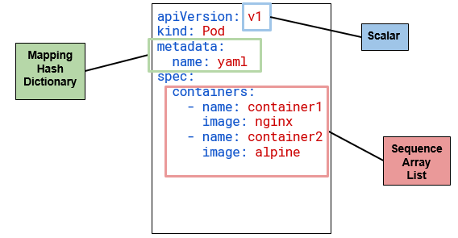
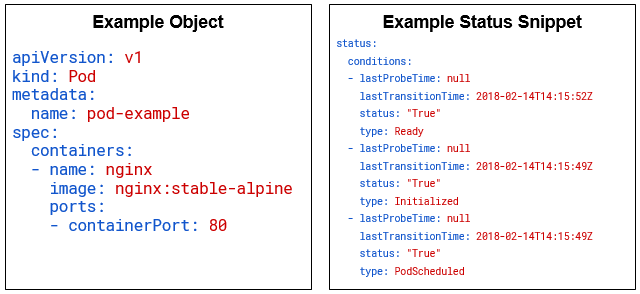
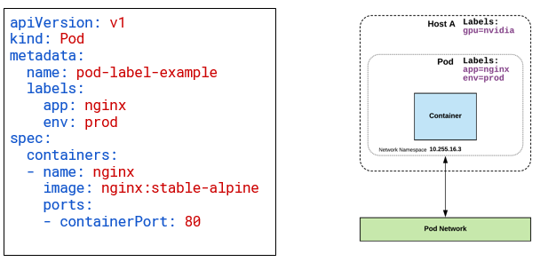
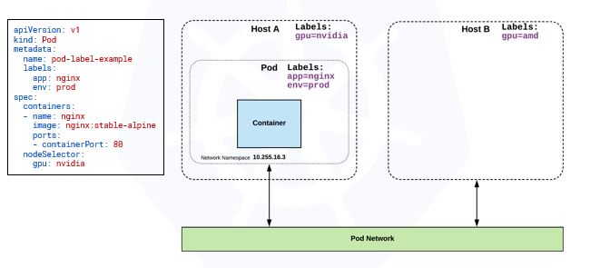
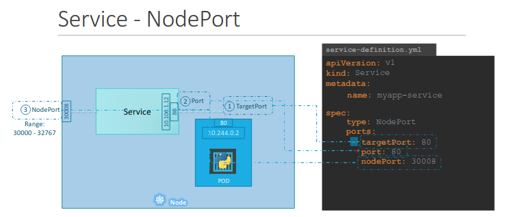

# K8s API
<!-- MDTOC maxdepth:6 firsth1:1 numbering:1 flatten:0 bullets:1 updateOnSave:1 -->

- 1. [K8s API](#k8s-api)   
- 2. [API ?](#api)   
   - 2.1. [API Versioning](#api-versioning)   
   - 2.2. [API Groups](#api-groups)   
   - 2.3. [Object model](#object-model)   
      - 2.3.1. [Object expression](#object-expression)   
      - 2.3.2. [Workloads Object Model](#workloads-object-model)   
- 3. [Core Concepts](#core-concepts)   
   - 3.1. [Namespaces](#namespaces)   
   - 3.2. [Pods](#pods)   
   - 3.3. [Labels](#labels)   
   - 3.4. [Selectors](#selectors)   
   - 3.5. [annotations](#annotations)   
   - 3.6. [Services](#services)   

<!-- /MDTOC -->

# API 

The REST API is the **KeyStone** of kubernetes .All operations and communications between components, and external users are API calls that the API Server handles . An object oriented architecture is used .  
**Main format:**

````html
/api/<version>
/apis/<group>/<version>/<resource>
````

## API Versioning

To eliminate fields or restructure resource representations, Kubernetes supports multiple API versions, each at a different API path.
The version is set at the API level rather than at the resource or field level to:  

- Ensure that the API presents a clear and consistent view of system resources and behavior.
- Enable control access to end-of-life and/or experimental APIs.
three main levels of stability in the API:

- `Alpha`:
  - **Disabled by Default**
  - Used by `alpha` word, example: `apiVersion: v1alpha1`
  - Features can be **buggy**
  - The support of a **feature can be dropped** at any time and without any notice
  - The API can change in a way that the feature may not work anymore
  - For **testing purposes only**
- `Beta`:
  - Used by `beta` word, example: `apiVersion: v1beta3`
  - **Enabled by Default**
  - The feature is **tested** and considered as **stable**
  - The support of the feature will not be dropped, though the details may change
  - **API schema may change**
  - **non-business-critical** uses because of potential for incompatible changes in subsequent releases
- `Stable`:
  - **Enabled by Default**
  - The version name is ``vX`` where X is an integer
  - **Released and stable** Feature with no change on the API schema
  - May be used on a production grade.

## API Groups

An API Group is a REST compatible path that acts as the type descriptor for a kubernetes object . API Groups make it easier to extend k8s API.
There is several types of groups used :  

- The core (also called legacy) group, which is at REST path ``/api/v1`` and is not specified as part of the ``apiVersion`` field, for example, ``apiVersion: v1``
- The named groups are at REST path ``/apis/$GROUP_NAME/$VERSION``, and use apiVersion: ``$GROUP_NAME/$VERSION`` (for example, ``apiVersion: batch/v1``  

Most used ones :

````sh
apiVersion: v1
  # for pods, volumes , pv, pvc,container
/apis/apps/v1/deployments
  # deployements
/apis/batch/v1beta1/cronjobs
 #cronjobs
````

## Object model

Objects are a persistant entity that represent the desired state of the object within the cluster . **EVERY** object **MUST** have ``apiVersion``, ``kind``, and poses the nested fields: ``metadata.name``, (can be inhereted )``metadata.namespace``, (can be generated Automatically)``metadata.UID``

- ``apiVersion``: Kubernetes API version of the Object
- ``kind``: Type of Kubernetes Object
- ``metadata.name``: Unique name of the Object
- ``metadata.namespace``: Scoped environment name that the object belongs to (will default to current).
- ``metadata.uid``: The (generated) uid for an object.

### Object expression

Files or other representations of k8s objects are generally represented in YAML.
2 main rules in writing YAML files :

- Uses white space alignment to denote ownership
- Three basic Data types :
  - Mappings: hash or dictionary,
  - Sequences: Array or list
  - Scalar: String, number, bool ...



### Workloads Object Model

Workload related objects within k8s have an additional two nested fields ``spec`` and ``status``  :

- ``status``: is managed by k8s and describes the actual state of the object and its history
- ``spec``: Describes the **desired state** or **configuration** of the object to be created  



# Core Concepts

Kubernetes has several core building blocks that make up the foundation of  their higher level components.

## Namespaces

Kubernetes supports multiple virtual clusters backed by the same physical cluster. These virtual clusters are called namespaces.
Creating a new namespace is needed when :

- Divide cluster resources between multiple users (When several users or teams share a cluster with a fixed number of nodes, there is a concern that one team could use more than its fair share of resources. we talk abbout ``resource quota``)
- When we need a unique names of ressources in the namespace. Creating a new namespace provides a new scope for names .
- A mechanism to attach authorization and policy to a subsection of the cluster  

⚠️ Most of the resources in k8s belongs to a namespace but not all of them : for example PVs are not attached to any namespace , you can see the complete list with `kubectl api-resources --namespaced=false`

### Default namespaces

Three initial namespaces:

- ``default``: The default namespace for objects with no other namespace
- ``kube-system``: Objects and resources created by k8s itself
- ``kube-public``: This namespace is created automatically and is readable by all users (including those not authenticated).This namespace is usually reserved for cluster bootstrapping and configuration.

### DNS entry

When you create a Service, it creates a corresponding **DNS entry**. This entry is of the form ``<service-name>.<namespace-name>.svc.cluster.local``, which means that if a container just uses ``<service-name>`` it will resolve to the service which is local to a namespace.  

## Pods

In this section we will discuss the implementation of pods not their significations , please refer to [README](README.md)  
Example of attributes that can be used to declare a pod:

- ``name``: The name of the container
- ``image``: The container image
- ``ports``: array of ports to expose. Can be granted a friendly name and protocol may be specified
- ``env``: array of environment variables
- ``command``: Entrypoint array (equiv to Docker ENTRYPOINT)
- ``args``: Arguments to pass to the command (equiv to Docker CMD)

````YAML
apiVersion: v1
kind: Pod
metadata:
  name: multi-container-example
spec:
  containers:
  - name: nginx
    image: nginx:stable-alpine
    ports:
    - containerPort: 80
    volumeMounts:
    - name: html
      mountPath: /usr/share/nginx/html
  - name: content
    image: alpine:latest
    command: ["/bin/sh", "-c"]
    args:
      - while true; do
          date >> /html/index.html;
          sleep 5;
        done
    volumeMounts:
    - name: html
      mountPath: /html
  volumes:
  - name: html
    emptyDir: {}
````

## Labels

Key/value pairs are used to group objects and resources together .Labels are intended to specify **identifying attributes of objects** that are meaningful and relevant to users without implying directly semantics to the core system (No technical labels but normal human readable names )
Labels are **NOT** characteristic of uniqueness .Each Key must be unique for a given object.

Example labels:

- "``release``" : "``stable``", "``release``" : "``canary``
- "``environment``" : "``dev``", "``environment``" : "``qa``", "``environment``" : "``production``"
- "``tier``" : "`frontend`", "``tier``" : "``backend``", "``tier``" : "``cache``"
- "``partition``" : "``customerA``", "``partition``" : "``customerB``"
- "``track``" : "``daily``", "``track``" : "``weekly``"



## Selectors

Selectors use labels to filter or select objects, and are used throughout Kubernetes.
Unlike names and UIDs, labels do not provide uniqueness. In general, we expect many objects to carry the same label(s).

Via a label selector, the client/user can identify a set of objects. **The label selector is the core grouping primitive in Kubernetes.**  
The API currently supports two types of selectors:

- **Equality-based**:  ``=``,``==``,``!=`` Matching objects must satisfy all of the specified label constraints
- **set-based** : ``in``,``notin`` and ``exists`` (only the key identifier): allow filtering keys according to a set of values  



## annotations

You can use Kubernetes annotations to attach arbitrary non-identifying metadata to objects. Clients such as tools and libraries can retrieve this metadata.
we can use annotations for : 
- Build, release, or image information like timestamps, release IDs, git branch, PR numbers, image hashes, and registry address.
-   User or tool/system provenance information, such as URLs of related objects from other ecosystem components.
...

annotations are **not used to identify and select objects**.
## Services

In this section we will discuss the implementation of services not their definition, please refer to [README](README.md#services)
Note that every service type are not distingushed but **built on top of one another**

### ClusterIP (default)

ClusterIP services exposes a service on a strictly cluster internal virtual IP.

````yml
apiVersion: v1
kind: Service
metadata:
  name: example-prod
spec:
  selector:
    app: nginx
    env: prod
  ports:
  - protocol: TCP
    port: 80
    targetPort: 80

````

from another pod we can access it via :

````sh
nslookup example-prod.default.svc.cluster.local
#Name:      example-prod.default.svc.cluster.local
#Address 1: 10.96.28.176 example-prod.default.svc.cluster.local
````

### NodePort

 Exposes the Service on each Node’s IP at a static port (the NodePort). A ClusterIP Service, to which the NodePort Service routes, is automatically created. You’ll be able to contact the NodePort Service, from **outside the cluster**, by requesting ``<NodeIP>:<NodePort>``

````yml
apiVersion: v1
kind: Service
metadata:
  name: example-prod
spec:
  type: NodePort
  selector:
    app: nginx
    env: prod
  ports:
  - nodePort: 32410
    protocol: TCP
    port: 80
    targetPort: 80

````



### LoadBalancer

The LoadBalancer service extends NodePort turns it into a highly-available externally consumable resource.This service uses external cloud provider's load balancer to expose service externally
:attention: **MUST** Work with some external system to provide cluster ingress

````yml
apiVersion: v1
kind: Service
metadata:
  name: example-prod
spec:
  type: LoadBalancer
  selector:
    app: nginx
    env: prod
  ports:
    protocol: TCP
    port: 80
    targetPort: 80

````

### ExternalName

ExternalName is used to reference endpoints OUTSIDE the cluster.it Creates an internal CNAME DNS entry that aliases another.

````yml
apiVersion: v1
kind: Service
metadata:
  name: example-prod
spec:
  type: ExternalName
spec:
  externalName: example.com

````
