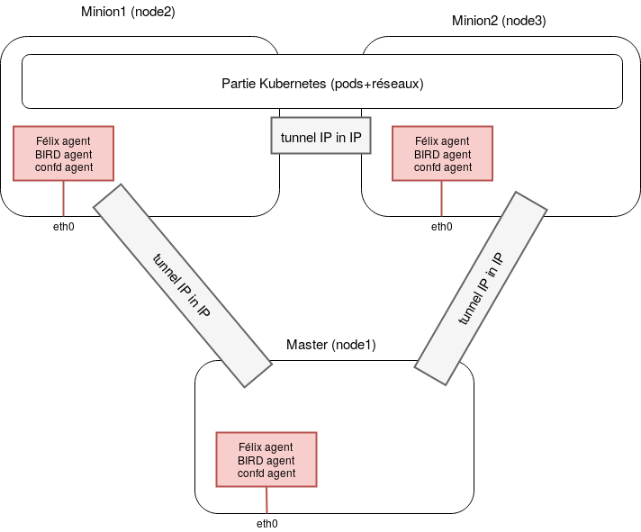
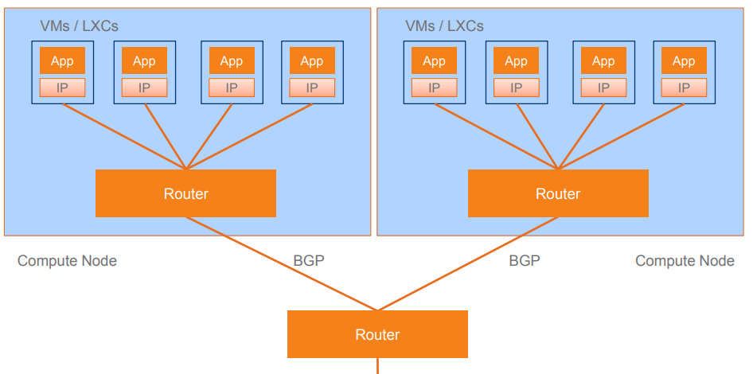
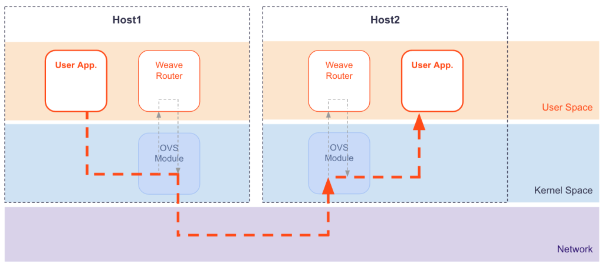

# Cluster networking Basics
ALL kubernetes networking is based on 4 rules :

- All loosely coupled containers within a pod can communicate with each others
- All pods can communicate with all other pods (Pods <-> Pods) **without NAT**
- All nodes can communicate with all Pods (Nodes <-> Pods) **without NAT**
- the IP that a Pod sees itself as is the same IP that others see it as.

4 problems to solve :
- Container-to-Container networking
- Pod-to-Pod networking
- Pod-to-Service networking
- Internet(external)-to-Service networking


## Container-to-Container Networking
By default linux assigns every process to the root network namespace to provide access to the external world .every node have a root network namespace by default.
When creating a new group of containers , docker will create a new network namespace (can be specified with net=...) and assign all of them to it.
Containers within this namespace will have the **same IP address and port space** and they **can reach each others via localhost** since they share the same namespace.


*Namespace networking within a pod (simplified)*

## Pod-to-Pod Networking
### Pod-to-Pod same node
**Pod ns to Root ns :**

From node's perspective, there is different  namespaces (ns) that needs to be connected to each other . we use a virtual ethernet interface (veth) to pair one namespace to the root network namespace. the veth is like a patch cable : connecting the two side and allowing traffic to flow between them.

**Pod ns to Pod ns:**

To connect the two veth of the namespaces , we use a linux ethernet bridge that will connect the two networks together :

The bridge (cbr0) operates by maintaining a forwarding table between sources and destinations by examining the destination of the data packets that travel through it and decides whether or not to forward the data by verifying the MAC address (Operating on layer 2 networking)
.

(In deep) bridges implements ARP protocol to discover the link-layer MAC address associated with a given IP address.When a data frame is received at the bridge, the bridge broadcasts the frame out to all connected devices (except the original sender) and the device that responds to the frame is stored in a lookup table. Future traffic with the same IP address uses the lookup table to discover the correct MAC address to forward the packet to.


*packet trip from a pod to another in the same node*

### Pod-to-Pod different node
Every node in the cluster is assigned a CIDR block specifying the IP adresses available to pods running on that node .when a pocket leaves the sender Node and enters the network , a network plugin will route the packet to the correct destination Node based on the CIDR block assigned to the destination Node . Most of the network plugins uses CNI(container network interface) to interact in the network.

### CNI Network plugins
<!-- change chapter position?? -->
A CNI Network plugins must be executed by the container system management. It manages the interface setup (and its IP) in a namespace and its configuration with the host (bridge connection and routes management).Communications are assured using a simple JSON Schema.

#### Default k8s network (kubenet)
Kubenet is a very basic simple network plugin, on linux only. its fast stable but have limited features .

the main idea is to configure cbr0 virtual bridge with an IP range, then add manually on each host a route between hosts (User Defined Routing (UDR) and IP forwarding is used for connectivity between pods across nodes).

we can use a cloud provider routing tables to store routes like VPC( limited to 50 nodes because AWS routing table is limited to 50) or azure virtual network (limited to 400 entries)

*example of Kubenet used in AKS*

#### Flannel
Flannel is a simple and easy way to configure L3 network fabric for K8s network. Flannel uses either kubernetes API (no database) or etcd directly to store the network configuration.Packets are forwarded using Vxlan (AWS VPC , GCP are in experimental mode)

Flannel's idea is simple : Create another flat network layer (Flannel overlay network) that creates a bridge in every host(node) and connects them via a shared VxLAN.

##### Agents

Flannel uses a single binary agent called `flanneld` implemented on each host (node) and responsible of all the network operations like routing and creating the bridged flannel interface  ...

##### Network details (in deep)
We will assume that a pod have only one container .

In this scenario contianer-1 (pod-1) in node 1 ` 100.96.1.2` wants to connect to the container-2 (pod-2) in node 2 `100.96.2.3` :


1) Container-1 creates an IP packet with `src: 100.96.1.2 -> dst: 100.96.2.3`
2) the packet is routed to `docker0` then `flannel0`
3) `flanneld` will fetch the destination address either from VxLAN Tunneling or Etcd (to verify)
4) `flanneld` wraps the original IP packet into a UDP packet, with it's own host's IP as a source address and the target hosts's IP as destination address.
5) In the other side (Node-2) `flanneld` deamon who listens on a default UDP port `:8285` will receive the packet . the packet wiil be traited (by the kernel) and routed to `flannel0` and then to Container-2 (pod 2).

#### Calico
While Flannel is positioned as the simple choice, Calico is best known for its performance, flexibility, and power.Calico is well-known for its advanced network features :
- support IPv6
- network policies
- integrate with istio (service mesh)

The idea behind Calico is that network plugins using overlay/underlay network are very complex,hard to troubleshoot,and limited scalability. The idea
behind Calico is that data streams should not be encapsulated, but routed instead

Calico offers two configurations :
- IPinIP protocol: (L3) uses encapsulation to transport packet to destination
- BGP protocol: (L3) Each node runs `BIRD` calico agent that acts like a router .As a result, Every node can  communicate with each others using BGP Protocol.
##### Agents
- ``Felix``: supplies end points (external interface), it shares ip table and routes between nodes.

- ``BIRD (bpg)``: client (and route reflector) used with confd for BGP.  BIRD is a daemon that act like a dynamic router used by Calico with BGP. It is used to centralize routes distribution.

- ``confd``: monitors Etcd for BGP configuration changes. It automatically manages BIRD configurations.

All agents are provisioned as one container launched in each node and as `calico-controller` in the master .

[Calico agents communication ](assets/Networking-5c2d3.png)
*Calico agents communication*
Calico uses etcd for key-value storage.it doesn't store routing tables in it .

##### Network details (in deep)
###### IPinIP

*IPinIP calico tunneling*
IP in IP is an IP tunneling protocol that encapsulates one IP packet in another IP packet.

To encapsulate an IP packet in another IP packet, an outer header is added with `SourceIP`(the entry point of the tunnel) and the ``DestinationIP`` (the exit point of the tunnel).The inner packet remains unchanged .

Calico will create all the tunnels between different components of the cluster and manage encapsulate/de-encapsulation of the Packets.
###### BGP

*BGP on calico*

As Calico does not connect containers via tunneling techniques,
segmentation between containers is achieved by modifying the iptables configuration of the host machine.

Effectively, Calico functions as a firewall between network segments.
All traffic between containers is routed at layer 3 via the Linux kernel’s native IP
forwarding engine in each host.
This means that no overhead is imposed when containers
try to communicate.

Calico use **BGP as a routing protocol** that tells other Calico nodes (and the rest of
the infrastructure) where workloads are at any given point in time.

#### Weavenet
⚠️ kernel ≥ 3.8, docker ≥1.10.0, Kubernetes ≥ 1.4, master with at least 2 CPU.
Weave net provides VxLAN on layer 2 networking for Kubernetes. It uses kube-proxy and kube-dns. It supports IPv4 and IPv6.

Weave creates a mesh overlay network between each of the nodes in the cluster, allowing for flexible routing between participants.To send traffic to another node,Weave  makes an automatic decision whether to send it via “fast datapath” or to fall back on the “sleeve” packet forwarding method.

##### agents
Each pod has two containers: ``weave`` (routing component) for managing traffic and ``weave-npc`` (Network Policy Controller) for managing the k8s ``NetworkPolicies`` .

Unlike other network solutions using etcd to stock data, WeaveNet saves its settings and data in a ``/weavedb/weave-netdata.db`` file and shares it on each pod .
##### Network details (in deep)

###### Fast Datapath

*fast datapath Weave Net*
The fast datapath in Weave Net uses the Linux kernel’s Open vSwitch datapath module. This module enables the Weave Net router to tell the kernel how to process packets.

Weave Net issues instructions directly to the kernel, context switches are decreased, and so by using fast datapath CPU overhead and latency is reduced. The packet goes straight from your application to the kernel, where the Virtual Extensible Lan (VXLAN) header is added (the NIC does this if it offers VXLAN acceleration).

###### sleeve mode
sleeve mode is available as a backup when the networking topology isn’t suitable for fast datapath routing. It is a slower encapsulation mode that can route packets in instances where fast datapath does not have the necessary routing information or connectivity.

(Same encapsulation (UDP) used in flannel )

[details ...](https://www.weave.works/docs/net/latest/concepts/router-encapsulation/)

#### Comparing K8s CNI Providers
| Solution  | K8s networkPolicies | IPv6 | Network Model (Layers) | Networks                                          | Route Distribution | Mesh | External Datastore | Encryption |             Ingress/Egress Policies            | Note |
|-----------|:-------------------:|------|:----------------------:|---------------------------------------------------|:------------------:|------|:------------------:|------------|:----------------------------------------------:|------|
| Calico    | Yes                 | Yes  |    L3  (IPinIP, BGP)   |             Many networks  on cluster             | Yes                | Yes  | Etcd (optional)    | Yes        | Yes                                            |      |
| Weave net | Yes                 | Yes  |       L2  (VxLAN)      |               Subnetworks  by nodes               | N/A                | Yes  | No                 | Yes        | Yes(does not have egress rules out of the box) |      |
| flannel   | No                  | No   |       L2 (VxLAN)       | Many networks  on same cluster  with multi daemon | No                 | No   | None               | No         | No                                             |      |
## Pod-to-Service Networking
## External-to-Service Networking

## Conclusion

we can keep in mind that :
- Container-to-Container managed by namespaces
- Pod network managed by a CNI
- Service Network managed by kube-proxy
# Proxies :oncoming_police_car: :bus: :ambulance:

https://kubernetes.io/docs/concepts/cluster-administration/proxies/

There are several different proxies you may encounter when using Kubernetes:

## kube-proxy
- proxies UDP, TCP and SCTP
- does not understand HTTP
- provides load balancing
- is just used to reach services /  pods load-balancing
three modes (first one is user-space deprecated 🔫  ) are available for kube-proxy:
### IPtables
iptables is a user-space application (no root needed) that allows configuring Linux kernel firewall (implemented on top of netfilter) by configuring chains and rules.

**:warning: Issues with IPTables as load balancer**
  - Latency to access service (routing latency)
  - Latency to add/remove rule

  IPTables are NOT incremental, for every manipulation, we have to copy all rules, make changes, save all rules back, note that IPTables are locked during rule update. When we have for exemple 20k services to implement with 8 rules/service (160k rules) we have to wait 5 hours to update tables :sleeping:

<!---
  - operates tables provided by linux firewall
  - manipulate packages at diffrent stage : pre-routing,post-routing,forward, input, output
  - do more operations : SNAT,DNAT, reject packets, port translation etc
--->

### IPvs
IPVS is a Linux kernel feature that is specifically designed for load balancing.
  - Transport layer load balancer which directs requests for TCP and UDP based services to real servers.
  - Same to IPTables, IPVS is built on top of Netfilter.
  - Support 3 load balancing mode: NAT, DR(L2 load balancing via MAC rewriting) and IP Tunneling

**:+1: Pros for using IPVS** :

  - Better performance (hash vs Chain(table))
  - More load balancing algorithm
      - Round robin, source/destination hashing
      - Based on latest load, least connection or locality, can assign weight to server
  - Support server health check and connection retry
  - Support sticky session

**:warning: pay attention to packet tracing**
packets that are handled by IPVS take a very different path through the iptables filter hooks** than packets under normal circumstances.  If you plan to use IPVS with other programs that use iptables then you will **need to research whether they will behave as expected together**. (Fear not though, Calico has been compatible with IPVS kube-proxy since way back when!)

### The kubectl proxy:

  - runs on a user’s desktop or in a pod
  - proxies from a localhost address to the Kubernetes apiserver
  - client to proxy uses HTTP
  - proxy to apiserver uses HTTPS
  - locates apiserver
  - adds authentication headers

#### Use case : Directly accessing the REST API with an http client (curl & wget ):

using kubectl proxy in this case is recommanded .it will do the most of the work for you :
  - Uses stored apiserver location
  - Verifies identity of apiserver self-signed cert
  - Authenticates to apiserver

Using kubectl proxy :

  ````sh
  kubectl proxy --port=8080
  curl http://localhost:8080/api/
  #expected
#  {
#  "versions": [
#    "v1"
#  ]
# }
  ````
### The Apiserver proxy:
is a bastion built into the Apiserver that can :
- connect a user outside of the cluster to cluster IPs which otherwise might not be reachable
- runs in the Apiserver processes
- used to reach a Node, Pod, or Service
- do load balancing when used to reach a Service

#### Protocols:
client -> Apiserver proxy uses HTTPS (or Http if Apiserver so configured)

Apiserver proxy -> target may use HTTP or HTTPS as chosen by proxy using available information
### The kube proxy:

- runs on each node
- proxies UDP, TCP and SCTP
- does not understand HTTP
- provides load balancing
- is just used to reach services

### (optional) A Proxy/Load-balancer in front of apiserver(s):

- existence and implementation varies from cluster to cluster (e.g. nginx)
- sits between all clients and one or more apiservers
- acts as load balancer if there are several apiservers.

### (optional) Cloud Load Balancers on external services:

- are provided by some cloud providers (e.g. AWS ELB, Google Cloud Load Balancer)
- are created automatically when the Kubernetes service has type LoadBalancer
- usually supports UDP/TCP only
- SCTP support (beta features on k8s) is up to the load balancer implementation of the cloud provider
- implementation varies by cloud provider.


# network policies ??
https://kubernetes.io/docs/concepts/services-networking/network-policies/

# references

https://www.projectcalico.org/comparing-kube-proxy-modes-iptables-or-ipvs/

https://sookocheff.com/post/kubernetes/understanding-kubernetes-networking-model/#kubernetes-networking-model

https://kubernetes.io/docs/concepts/cluster-administration/networking/

https://kubernetes.io/docs/concepts/cluster-administration/proxies/

https://kubernetes.io/docs/concepts/services-networking/ingress/

https://www.objectif-libre.com/en/blog/2018/07/05/k8s-network-solutions-comparison/


https://developers.redhat.com/blog/2018/10/22/introduction-to-linux-interfaces-for-virtual-networking/#bridge

https://docs.microsoft.com/en-us/azure/aks/configure-kubenet

https://github.com/kubernetes/kops/blob/master/docs/networking.md

https://blog.laputa.io/kubernetes-flannel-networking-6a1cb1f8ec7c

https://github.com/coreos/flannel

[Docker Overlay Networks.pdf](ressources\Docker_Overlay_Networks.pdf)

[calicoandbgp.pdf](ressources\calicoandbgp.pdf)

[k8s networking rancher.pdf](ressources\Diving_Deep_Into_Kubernetes_Networking_rancher.pdf)
