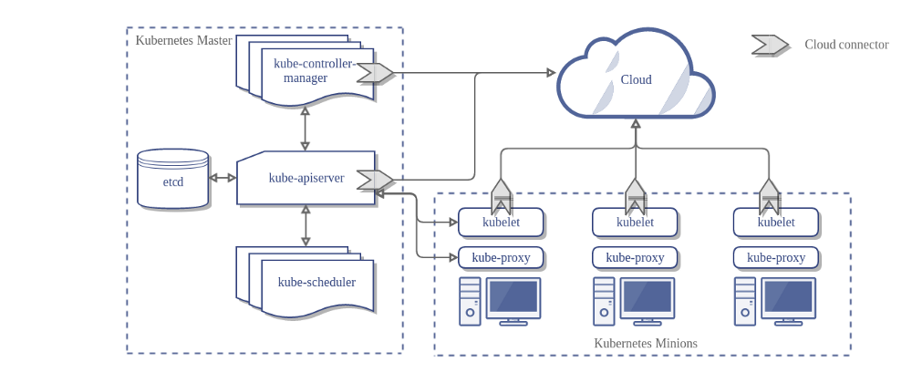
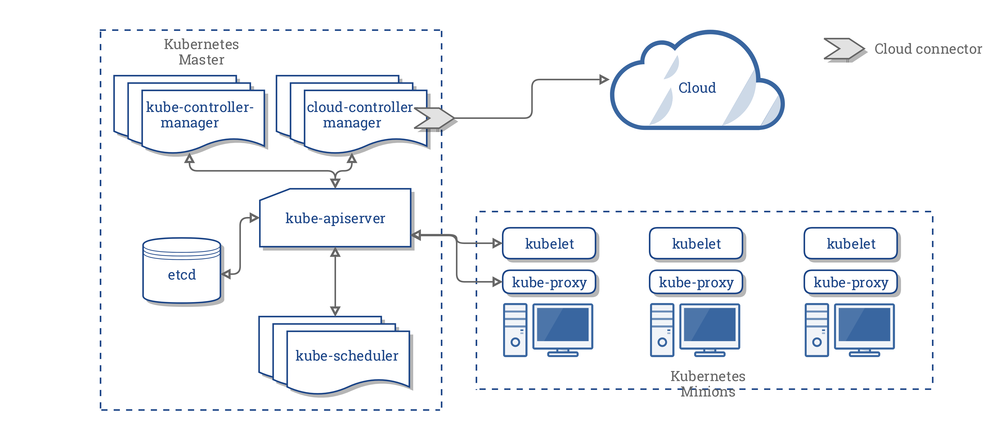

# the-magic-world-of-Kubernetes
One year study on kubernetes subject
<!-- MDTOC maxdepth:6 firsth1:1 numbering:1 flatten:1 bullets:1 updateOnSave:1 -->

- 1. [the-magic-world-of-Kubernetes](#the-magic-world-of-kubernetes)   
- 2. [Terminology](#terminology)   
- 3. [The right Definition of Kubernetes](#the-right-definition-of-kubernetes)   
- 4. [Kubernetes Architecture](#kubernetes-architecture)   
- 4.1. [Master (Cluster control plane component) 🧠](#master-cluster-control-plane-component-🧠)   
- 4.1.1. [Master Components](#master-components)   
- 4.1.1.1. [Kube-APIserver](#kube-apiserver)   
- 4.1.1.2. [Etcd](#etcd)   
- 4.1.1.3. [Kube-Controller-Manager](#kube-controller-manager)   
- 4.1.1.4. [Kube-Scheduler](#kube-scheduler)   
- 4.1.2. [Optional Services](#optional-services)   
- 4.1.2.1. [Cloud-Controller Manager](#cloud-controller-manager)   
- 4.1.2.2. [Cluster DNS](#cluster-dns)   
- 4.1.2.3. [Kube Dashboard](#kube-dashboard)   
- 4.2. [Node](#node)   
- 4.2.1. [Node Component](#node-component)   
- 4.2.1.1. [Kubelet: :vertical_traffic_light: :blue_heart:](#kubelet-vertical_traffic_light-blue_heart)   
- 4.2.1.2. [Container Runtime:](#container-runtime)   
- 4.2.1.3. [Kube-Proxy :](#kube-proxy)   
- 4.2.1.4. [cAdvisor (now integrated in kubelet)](#cadvisor-now-integrated-in-kubelet)   
- 4.2.1.5. [Using Probes](#using-probes)   
- 4.3. [Master-Node Communication](#master-node-communication)   
- 4.3.1. [Cluster ➡️ Master](#cluster-➡️-master)   
- 4.3.2. [Master ➡️ Cluster](#master-➡️-cluster)   
- 4.3.2.1. [APIserver -> Kubelet](#apiserver-kubelet)   
- 4.3.2.2. [APIserver <-> Kube-Proxy](#apiserver-kube-proxy)   
- 4.3.2.3. [Apiserver to nodes, pods, and services](#apiserver-to-nodes-pods-and-services)   
- 4.4. [Container](#container)   
- 4.4.1. [Container States](#container-states)   
- 4.5. [Pod](#pod)   
- 4.5.1. [Pod Status](#pod-status)   
- 4.6. [Services](#services)   
- 4.6.1. [Use Case (frontend-backend)](#use-case-frontend-backend)   
- 4.6.2. [Types of Services :](#types-of-services)   
- 5. [Networking](#networking)   
- 6. [Core Concepts](#core-concepts)   
- 6.1. [Services](#services)   
- 6.1.1. [Cluster IP Service](#cluster-ip-service)   
- 6.1.2. [NodePort Service](#nodeport-service)   
- 6.1.3. [LoadBalancer Service](#loadbalancer-service)   
- 6.2. [pods](#pods)   
- 6.3. [Namespaces](#namespaces)   
- 6.4. [Labels](#labels)   
- 6.5. [Selectors](#selectors)   
- 7. [API](#api)   
- 8. [Security](#security)   
- 8.1. [TLS bootstrapping](#tls-bootstrapping)   
- 8.2. [Authentication](#authentication)   
- 8.3. [authorization](#authorization)   
- 8.3.1. [RBAC authorization](#rbac-authorization)   
- 9. [References](#references)   

<!-- /MDTOC -->

# Terminology
refer to `Terminology.md`

# The right Definition of Kubernetes

> We can't work on a technology if we can't clearly define it  !

Kubernetes is a production-grade, open-source infrastructure for the deployment, scaling, management, and composition of *application containers* across clusters of hosts. Mainly defined as a **'Container Orchestrator'**, kubernetes provides container runtime, container orchestration, container-centric infrastructure orchestration, self-healing mechanisms such as health checking and re-scheduling, and service discovery and load balancing
Kubernetes aims to :
- Eliminate the burden( heavy load) of orchestrating physical/virtual compute, network, and storage infrastructure. This will enable developers application and operators to focus entirely on container-centric primitives for self-service operation.
- stable, portable foundation for building customized work-flows and higher-level automation.

Kubernetes is based on the following *design ideals*:

- **Portable**: Runs everywhere (cloud,private, bare metal, home laptop) with consistent behavior so that applications are portable throughout the ecosystem as well as between development and production environments.
- **General-purpose**: kubernetes can run all majors categories of workloads on a same infrastructure , stateless and stateful,services and batch, greenfield and legacy systems .
- **Meet users partway**: kubernetes adapts to the need of the user .it doesn't just supply a purely greenfield cloud-native applications but provides mechanisms to facilitate migration of monolithic and legacy applications.

- **Flexible**: kubernetes functionality can be consumed "à la carte" .you can even use your own solutions instead of build-in functionality.
- **Extensible**: kubernetes enables you to add additional capabilities to you environment.
- **Automatible**:The main goal of kubernetes is to reduce the burden of manual operations. By using declarative approach , the user defines the desired intent via API and kubernetes make it happen :rocket: . Imperative control is used to support high level orchestration and automation.
- **Advance the state of the art**: kubernetes is designed to advance the cloud native and Devops state of the art without forcing applications to depends on Kubernetes API .

# Kubernetes Architecture

We can define Kubernetes cluster with 5 main components :

- **Container**: A container is a standard unit of software that packages up an application with all its dependencies so that the application runs quickly and reliably from one container to another .
`Containers don't make microservices,Containers change the level of encapsulation, of isolation from a virtual machine to a process`
benefits of containers (https://cloud.google.com/containers/)
- **Pod** : smallest component in a kubernetes cluster . it contains one or more containers and unique IP Address (Container of containers)
- **Node**: Known also as Minion is a Virtual or physical machine that contain all the necessary services to run pods (Container runtime, kubelet, kube-proxy).they are managed by the master (Pods Manager :oncoming_police_car:)
- **Master (Cluster control plane)** : This is the Boss :fire: this component is a responsible for exposing the (API), scheduling the deployment and managing all the components of the cluster .

In the next section we will go into the details of each component:
## Master (Cluster control plane component) 🧠
Master components provide the cluster's control plane. Master components are considered as the brain of the cluster: they make decisions , execute, scheduler then and monitors it. they also detect and respond to any cluster events . Master components can be run on any machine in the cluster to ensure HA cluster with multi-master VM setups.

*Simplified architecture of K8s*

*Advanced architecture of K8s*
### Master Components
#### Kube-APIserver
kubernetes API server is the central unit for managing all the cluster . ALL Components interact with each other through the API . Kube-Apiserver acts also like a gatekeeper :door: by handling authentication and authorization, request validation, mutation and admission control .Also this is the only component that communicates with the etcd cluster (for security reasons), making sure data is stored in etcd and is in agreement with the service details of the deployed pods .
#### Etcd
etcd is a consistent and highly-available key value store used as Kubernetes’ backing store for all cluster data(like objects and config information).
the main focus of etcd is :
  - Simple: well-defined, user-facing API (gRPC)
  - Secure: automatic TLS with optional client cert authentication
  - Fast: benchmarked 10,000 writes/sec
  - Reliable: properly distributed using [Raft distributed algorithm](http://thesecretlivesofdata.com/raft/)

#### Kube-Controller-Manager
Acts like a primary daemon that manages all core components of the cluster. It also monitors the state of the cluster via Apiserver and **steers the cluster towards the desired state.**

:exclamation:the kube controller manager **does NOT handle scheduling**, his job is to decide whether add, remove pods for exemple and sends the request to the APIserver.
Controllers includes :
- Node controller: Responsible for noticing and responding when nodes go down
- Replication Controller : Responsible for maintaining the correct number of pods for every replication controller object in the system.
- Endpoints Controller : populates the endpoint object (Automatically joins services & pods )
- Service Account & Token Controllers : Create default accounts and API access tokens for new namespaces

#### Kube-Scheduler
scheduler decides **which nodes should run which pods**, updates pod with a node assignment, nodes poll checking which pods have their matching assignment and takes in consideration various criteria like:
- General hardware requirements
- affinity/anti-affinity
- labels, and other various custom resource requirements.
- taints and tolerations
The Kubernetes scheduler is a policy-rich, topology-aware, workload-specific function that significantly **impacts availability, performance, and capacity.workload**

➕ we can run multiple schedulers in the same cluster example : kube-batch  

### Optional Services
#### Cloud-Controller Manager
the main idea behin the cloud controller manager is to have a single point of integration with the cloud
Here’s the architecture of a Kubernetes cluster without the cloud controller manager:

the new architecture with the cloud-controller manager would be :

Cloud-controller manager acts like a daemon that provides a cloud-provider specific knowledge and integration capability into the control loop of kubernetes . It mainly runs specific controllers that interacts with the cloud provider .those control loops MUST be disabled in the kube-controller-manager.
Controllers includes :
  - Node controller : Checking the cloud provider to determine if a node has been deleted in the cloud after it stops responding
  - Route controller : For setting up routes in the underlying cloud infrastructure
  - Service controller: For creating,updating and deleting cloud provider load balancers
  - Volume controller : For creating, attaching, and mounting volumes and interacting with the cloud provider to orchestrate volumes.

#### Cluster DNS
CoreDNS is a general-purpose authoritative DNS server that can serve as cluster DNS, complying with the dns specifications. CoreDNS is the recommended DNS Server, replacing kube-dns. However, kube-dns may still be installed by default with certain Kubernetes installer tools.
these are some differences :
  - CoreDNS is a single container per instance, vs kube-dns which uses three.
  - Kube-dns uses dnsmasq for caching, which is single threaded C. CoreDNS is multi-threaded Go.
  - CoreDNS enables negative caching in the default deployment. Kube-dns does not.
> to verify
> Even when you install coreDNS, you will always have kube-dns running because it's somthing that the application depends on it's by design.if you check kube-dns service points on coreDNS pods

#### Kube Dashboard

general purpose web front end for the Kubernetes Cluster.

## Node
The Kubernetes node has the necessary tools  to run application containers and be managed from the master systems.it's most likely a VM or physical machine .

*Simplified view of a node*

*Advanced view of a node*
### Node Component
#### Kubelet: :vertical_traffic_light: :blue_heart:
the most important controller in k8s .it's the primary implementer of the pod and node APIs that drive the container execution layer .kubelet is required on every host in the k8s cluster (even in the master .)he's always watching kube-apiserver for any change (ensures that the containers described in those PodSpecs are running and healthy) . in addition, we can communicate to kubelet via HTTP endpoint, HTTP server or file.

 :space_invader: to verify -> Kubelet monitor containers with hooks, pod's policy, podSpec ..

#### Container Runtime:

 is typically docker , used to manage containers in the node

#### Kube-Proxy :

 the network "plumber " for kubernetes services (manages the network rules in each node) ,his main job is to proxy UDP, TCP, and SCTP packets (it doesn’t understand HTTP). It maintains the network rules on the host and handles transmission of packets between pods, the host, and the outside world.

 He also enables in-cluster load-balancing and service discovery . Two modes are available (IPvs, IPtables).
 <!--
 Refer to network /kube-proxy
 -->  

#### cAdvisor (now integrated in kubelet)
collects metrics about pods running on that particular node

#### Using Probes
To enhance monitoring feature,The kubelet can optionally perform and react to three kinds of probes on running Containers.
- Liveness probes : can be used to know when to restart a container , for example, Liveness probes could catch a deadlock : an application is running but unable to make progress . if the process in your container is **able to crash/become unhealthy on its own** whenever it encounters an issue , we don't need a liveness probe (pod's Restart policy can )  
- Readiness probes : can be used to know when a container is ready to **start accepting traffic** . this probe is usually used when the container needs to work on loading large data, configuration files or migrations during startup.
- Startup probes : used for containers with a slow start (exceeds default start-time `initialDelaySeconds + failureThreshold × periodSeconds`).this will avoid kubelet kill those containers before they are up and running.
kubelet three mechanisms for implementing those probes :

1) running a command inside a container
2) making an HTTP request against a container
3) opening a TCP socket against a container.

Probes are very powerful tools to monitors containers but also very confusing if these probes are not carefully implemented . refer to : https://blog.colinbreck.com/kubernetes-liveness-and-readiness-probes-how-to-avoid-shooting-yourself-in-the-foot/

## Master-Node Communication
All communications paths from the cluster to the master terminate at the Apiserver.

### Cluster ➡️ Master

In a typical deployment, the APIserver is configured to listen for remote connections on a HTTPS (443) with **one or more forms of client authentication enabled** (client certificates, bearer tokens, an authenticating proxy, or HTTP basic auth). **One or more forms of authorization** should also ben enabled (Node, ABAC, RBAC, Webhook).

**Nodes** should be **provisioned with the public root certificate** for the cluster such that they can connect securely to the APIserver along **with valid client credentials**.

:cloud: Default GKE deployment uses Clients certificate authentication :the client credentials provided to the kubelet are in the form of a client certificate. With this type of authentication we can use Kubelet TLS bootstrapping.

### Master ➡️ Cluster

Two primary communication paths from the master (APIserver) to the cluster :

#### APIserver -> Kubelet

The connections from the apiserver to the Kubelet are used for:

  - Fetching logs for pods
  - Attaching (through kubectl) to running pods.
  - Providing the kubelet's port-forwarding functionality.

**By default, the apiserver does not verify the kubelet's serving certificate** which makes connection subject to man in the middle attack and unsafe to run over untrusted and/or public networks.
Two possible solutions to this case :
  - Provide the APIserver with the root certificate bundle to use to verify the kubelet's serving certificate (using `kubelet-certificate-authority`).
  - (deprecated 🔫 ) SSH tunneling between the apiserver and kubelet.

#### APIserver <-> Kube-Proxy

kube-proxy watches the APIserver for pods/services changes in order to maintain the network up to date .

#### Apiserver to nodes, pods, and services

In this connection the Apiserver is used as a proxy to reach any node,pod, or service .

the connections from the apiserver to a node,pod, or service **default to plain HTTP connections and therefore neither authenticated nor encrypted**.

they can be run over a secure HTTPS connection by prefixing `https` to the node,pod, service name in the API URL, but they will NOT validate the certificate provided by the HTTPS endpoint nor provide client credentiels so while the connection will be encrypted, it will NOT provide any guarantees of integrity.

:bangbang: These connections are not currently safe :skull: to run over untrusted networks.
<!---
Refer to networking / APIserver proxy functionality section
-->

## Container

I suppose that you have minimum requirement on this subject to work on kubernetes

### Container States
Once Pod is assigned to node by scheduler, kubelet starts creating containers using container runtime .
- Waiting : (default state) a container in this state is most likely doing its required operations like pulling images, applying secrets ..
- Running: :ok_hand: all good (postStart hook executed)
- Terminated : A container in this state is either successfully completed his duty OR failed for some reason .(preStop hook executed)

## Pod

The smallest "unit of work " of kubernetes considered as **ephemeral**. Pods are one or more containers that share a network, namespace, and part of a single context.
a shared pod's context is a set of linux namespaces, cgroups  ...

containers within same pod share an IP address and port space they can find each other via localhost and can communicate with each other via standard inter-process communication like POSIX ..

:grey_exclamation:Containers in different Pods can not communicate by IPC (inter-process communication ) without special config

Pods model is defined as application specific "logical host", it means that a pod contains one or more application containers which are relatively tightly coupled.
:exclamation:Pods are scaled up and down as a unit, all containers in a pod must scale together regardless their individual needs.it may lead to wasted resources and expensive bills.
:

:question: Why not just run multiple programs in a single (Docker) container?
Using pods enhances transparency,decoupling software dependencies,ease to use and efficiency.
<!--

-->

### Pod Status
- Pending : pod accepted by k8s system but one or more container has not been created
- Running :ok_hand: the pod is linked to a node, and all containers have been created. At least one Container is still running, OR is in the process of starting or restarting.
- Succeeded: All Containers in the Pod have terminated in success, and will not be restarted.
- Failed: All containers in the pod have terminated in success, and will not be restarted.
- Unknown: the state of the pod could not be obtained, typically due to an error in communicating withe host.

https://medium.com/faun/the-first-introduction-to-kubernetes-62d26f99caff

## Services
A service is an abstraction which defines a logical set of pods and a policy by which to access them  
Services are **persistent** objects used to reference ephemeral resources.
for ensuring this persistence we can define :
  - static cluster IP
  - Static namespaced
  - DNS Name
We can define labels and selectors to
### Use Case (frontend-backend)
if we have 3 replicas of our backend .3 pods -> 3 different Ip address .which one we will choose to connect it to the frontend pod . In this case we can define a service which points on our 3 replicas and then points the frontend on the service .
### Types of Services :
Every type of services is built in on top of another .
- **ClusterIP** (default) service **only accepts** traffic from within the cluster.

- **NodePort**: service allows external traffic to be routed to the pods on a specific port you'll be able to contact pods via `<NodeIP>:<NodePort>`
Port can be mapped ether statically defined or dynamically defined (taken from a specific range defined by `--service-node-port-range` flag)

- **Loadbalancer**: exposes the service externally using a cloud provider's load balancer.LoadBalancer services extend NodePort

- **ExternalName**: Maps the Service to the contents of the externalName field (e.g. foo.bar.example.com), by returning a CNAME record. (CoreDNS 1.7 or higher is needed to use this ype)

📓Note : For exposing service to external traffic we usually use **ingress** as an entry point to the cluster .it lets you consolidate your routing rules into a single resource as it **can expose multiple services under the same IP**.

Todo: Selectors / Labels and namespaces
https://kubernetes.io/docs/concepts/overview/working-with-objects/labels/

# Networking
refer to `networking.md`

# Core Concepts
## Services
### Cluster IP Service

we define a service with 10.0.165.39
1- A Pod in host C try to reach other pods, he will point out on the service IP address directly . Technically  the request hits host Iptables and it load-balances the connection between endpoints residing on the other hosts A and B. **Kubeproxy is responsible for updating iptables when a change occurs on the service (scaling up & scaling down).**

### NodePort Service
user can hit any host on nodeport IP and get to service even from external source

### LoadBalancer Service
works with an external system to map a cluster external IP (provide cloud provider ) to the exposed port.

Traffic from the external load balancer is directed at the backend Pods. **The cloud provider decides how it is load balanced.**

>IPVS is introduced in k8s v1.8 . IPVS is more performant and opens the door to a wider feature set (port ranges, better lb rules etc) . Iptables is actually a bottle neck to scale clusters up to 5000 nodes.

## pods

change place ?
## Namespaces
## Labels
https://kubernetes.io/docs/concepts/overview/working-with-objects/labels/
## Selectors

# API
# Security
https://kubernetes.io/docs/tasks/administer-cluster/securing-a-cluster/
## TLS bootstrapping
https://kubernetes.io/docs/reference/command-line-tools-reference/kubelet-tls-bootstrapping/
## Authentication
https://kubernetes.io/docs/reference/access-authn-authz/authentication/
## authorization
### RBAC authorization
https://kubernetes.io/docs/reference/access-authn-authz/rbac/
# References
- https://www.bizety.com/2018/08/21/stateful-vs-stateless-architecture-overview/
- https://github.com/tkssharma/k8s-learning
- https://medium.com/tkssharma/kubernetes-architecture-quick-introduction-4ade0bd250d3
- https://github.com/kubernetes/community/blob/master/contributors/design-proposals/architecture/architecture.md
- https://www.simpleorientedarchitecture.com/8-fallacies-of-distributed-systems/
- https://dzone.com/articles/the-rise-of-service-mesh-architecture?preview=true
- https://dzone.com/articles/sidecar-design-pattern-in-your-microservices-ecosy-1
- https://kubernetes.io/docs/concepts/architecture/master-node-communication/
- https://www.ovh.com/blog/getting-external-traffic-into-kubernetes-clusterip-nodeport-loadbalancer-and-ingress/
