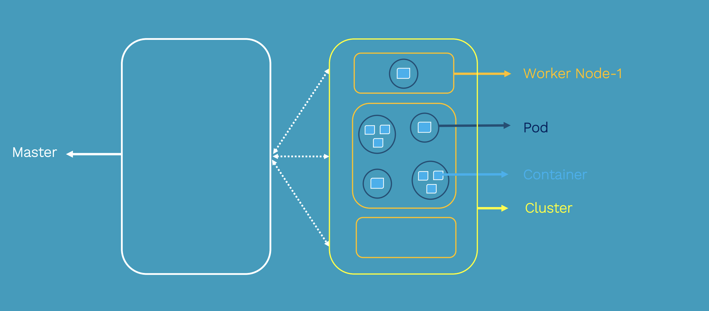

# the-magic-world-of-Kubernetes
One year study on kubernetes subject

# Terminology
- **bridge networks** : a link layer that forwards traffic between network segments . For docker , a bridge network allows containers connected to the same bridge to communicate while providing isolation from containers which are not connected to that bridge network.
- **NAT**: Network address Translation : NAT translates the IP addresses of computers in a local network in a single IP ADDRESS
- **egress traffic**:  traffic that exits an entity or a network
- **ingress traffic** : enters the boundary of a network
- **IPVS** : (IP Virtual Server) is built on top of the Netfilter and implements transport-layer load balancing as part of the Linux kernel.
- **CRUD** : Create, read, update and delete
- **Fault tolerance** Is the property that enables a system to continue operating properly even when some of its components fails.

- **Fault Injection**:is a technique which aids in understanding how [virtual/real] system behaves when stressed in unusual ways.
- **Mainframe**: are computers used primary by large organizations for critical applications, data processing ..
- **Circuit breaker**: it's common for microservices to make remote calls to other microservices across a network .Unlike in-memory calls, Remote calls can fail or hang without response until some timeout limit is reached.if you have many callers on unresponsive service :ghost:, then you can run out of critical resources and leading to cascading failures and crushing your system :skull:. Thats where a circuit breaker can step in .

 the basic idea is like electrical circuit breaker : when the number of **consecutive failures** crosses a threshold, the **circuit breaker trips**, and for the duration of a timeout period all temps to invoke the remote **service will fail immediately**
 
- **Idempotent operation** : is an operation with no additional effect if it is called more than once with the same input parameters. In mathematics , an idempotent operation is one where `f(f(x))=f(x)`
- **RBAC**: (Role-Based Access Control) is an approach to restricting system access to authorized users .RBAC lets a user have access rights only to the information they need to .

- **stateless applications**: runs one function or service and does not require a persistent storage to work . all data-flow passed via a stateless service is typically transitory and the state is stored only in a separate a third-party back-end service like a database .Any associated storage is typically ephemeral. it ensures scalability and portability of the application .
- **stateful applications** : are typically databases .those applications processes requests based on the information relayed with each request and information stored from earlier requests .As a result , a stateful application must hold onto state information generated during the processing of the earlier request. [if you wonder how we can maintain state information ? ]( https://www.bizety.com/2018/08/21/stateful-vs-stateless-architecture-overview/)
- **Monolithic application**: describes a single-tiered software application in which the user interface and data access code are combined into a single program from a single platform.A modification made to a small section of code might require building and deploying an entirely new version of software.
- **batch processing**: a group of jobs, data or programs treated as one unit (traitement en lot in french)
- **legacy system**: outdated system but still being used .
- **Greenfield project**: A system developed in a total new environment:  new infra, new customers and even new owners.
- **CNI**: container network interface
- **CIDR**:(Classless inter-domain routing) also known as Supernets is a method for assigning IP addresses without using the standard IP address classes like Class A, Class B or Class C . For example, in the CIDR address 65.70.30.10/26, the /26 indicates the first 26 bits are used to identify the unique network leaving the remaining bits to identify the hosts. with CIDR , we have more control of the network, we can set a 50.25.11.2/17 mask (which whose forbidden in subnetting with classes) with a total of 32,768 IPs in range between 50.25.0.0 - 50.25.127.255.
- **Multilayered software architecture**: is a client-server architecture in which presentation, application processing, and data management functions are physically separated.
common layers are :
  - Presentation layer: UI to the end-user
  - Application layer: contains all the logic that is required by the application to meet its functional requirements
  - Domain layer ; mostly consisting of domain entities and, in some cases, services. Business rules, like invariants and algorithms, should all stay in this layer.
  - (optional but important) Infrastructure Layer (aka persistent layer ) :enables our application to interact with external systems by receiving, storing and providing data when requested. this optional layer will make our application loosely coupled from the technology used .
- **Three-tier architecture**: based on multi-layered architecture and composed from three main layers : presentation tier were the UI is exposed, application tier where all processing is done and data layer where all data is exchanged and stored .

- **Cattle, not pets approach**: Pets are servers that are treated as indispensable or unique systems that can never be down.Cattle are arrays of more than two servers that are built using automated tools and are designed for failure where **no one is irreplaceable**.
- **Serialization/Deserialization**:serialization is the conversion of **an object to a series of bytes**, so that the object can **easily saved** to persistent storage or streamed across a communication link .the byte stream can then be deserialized means converted into a replica of the original object.( Most used are JSON and google protocol buffers)
- **Race condition**:In multi-threading application , a race condition occurs when two or more threads can access shared data and they try to change it at the same time .
- **8 Fallacies of distributed systems**: Fallacies are a mistaken belief based on unsound arguments .
    - **The network is reliable** : Calls over network will fail due to congestion or hardware failure for example ...
    - **Latency is zero** : Calls over network are not instant . always separate In memory calls and networks calls. Always bring back all the data you might need and not work with chatty mode. Store what can be stored locally.
    - **Bandwidth is infinite** : Bandwidth is limited. use Domain-Driven Design patterns to limit the impact.You should transfer less data to minimize bandwidth usage. You need to balance these two forces and find the right amount of data to send over the wire.
    - **The network is secure** : no it's not . Even you harden security on your own code and your communications , pay attention on using open source libraries, third party legacy systems... An openSSL vulnerability allowed people to steal data protected by SSL/TLS.
    - **Topology doesn’t change** : Network topology changes all the time . Abstract physical structure of the network ( no hardcoding IPs,Dns and service discovery ..) , and adopt Cattle, not pets approch .
    - **There is one administrator** : no one knows everything . On a distributed systems, many persons are involved in the application .If something went wrong, every one must be responsible and tries to solve the problem .Logging , monitoring, decoupling applications and isolating 3rd party dependencies are essential keys for good administration.
    - **Transport cost is zero** : Related to fallacy of zero-latency , Zero cost transport fallacy is related to cost and resource consumption . Transport cost can be either from the cost of the networking infrastructure (On prem instances, Network switchers , SAN ...) or serialization/deserialization (CPU consumption, time cost ..).For infra we can't reduce this cost but for serialization/deserialization it can be redesigned more efficiently by using JSON or Google’s Protocol Buffers and replacing old systems like SOAP or XML.
    - **The network is homogeneous** :A homogeneous network is a network where all components have the same config and the same communication protocol. all networks in the world is not homogeneous so we have to standardize formats in order to avoid vendor lock-in.
- **Sidecar design pattern** allows you to add a number of capabilities to your application without additional configuration code for third-party components.As a sidecar is attached to a motorcycle, similarly in software architecture a sidecar is attached to a parent application and extends/enhances its functionalities. A sidecar is loosely coupled with the main application.**if a sidecar is detached the main functionality will still do her main goal**
-  **Microservices**: microservice architecture theory : 'Small autonomous services modeled around a business domain that work together.' by sam newman . a microservice architecture is an architectural style that structures an application as a collection of services that are :
  - **Loosely coupled** : each component of the system has or make use of little or no knowledge of the the components of the system

  - **Highly maintainable and testable**
  - **Independently deployable**
  - **Organized around business capabilities** : Every single team can process an entire business capability . the opposite strategy would be to organize teams and services around technology layers : if we take example of implementing the business capability of  "a reminder is sent by mail" feature .in a classic approach we have to involve UI team, DBA team, the Invoicing Team, the mail/communication team...
  it may lead to duplicated code BUT the cost of duplicating a bit of code is a lot lower than the cost of introducing tight coupling like sharing bib .
  - Owned by a small team

    [🚗 more on microservices topic](https://medium.com/citerus/whats-the-deal-with-this-microservices-thing-everyone-talks-about-fecc2883049a)
    [ 🎓 topic to study From Monolith to Microservices ](https://dzone.com/articles/from-monolith-to-microservices)
    - [ ] :construction_worker: try to migrate from a monolithic application to microservices application  [refer to] (https://medium.com/jeroen-rosenberg/from-monolith-to-microservice-architecture-on-kubernetes-part-1-the-api-gateway-eb82f8c2d10c )
    - 👷 [1st example] (https://github.com/ticket-monster-msa/monolith)
    - 👷 [2nd example] (https://github.com/micro-example/monolith-to-microservices)
    - 👷 [3rd example] (https://github.com/vmudigal/microservices-sample)
- **Serverless Architecture** : is a way of building applications without need to manage infrastructure . Developers will more focus on their code rather then the infra .   

  [🚗 more about Serverless topic](https://medium.com/swlh/serverless-architecture-complete-reference-guide-2019-55363c08d1be)
  >The essence of the **serverless** trend is the absence of the server concept **during software development**

  :question: is it cheaper than classic approach ? : it depends , Car analogy :
  

  - **Multi-tenancy architecture** is an architecture in which a single instance of a software application serves multiple customers.Each customer is called a tenant. Tenants may be given the ability to customize some parts of the application, such as color of the user interface (UI) or business rules, but they cannot customize the application's code.
  

- **Namespace**: an abstraction used in k8s to support multiple virtual clusters on the same physical cluster.
- **Kops**: tool to deploy a production grade kubernetes cluster .
- **Service mesh**: A service mesh is a way to control how different parts of an application **share data with one another**. Unlike other systems for managing this communication, a service mesh is a dedicated infrastructure layer built right into an app. This visible infrastructure layer can document how well (or not) different parts of an app interact, so it becomes easier to optimize communication and avoid downtime as an app grows.
- **Production Ready K8s**:https://www.weave.works/blog/what-does-production-ready-really-mean-for-a-kubernetes-cluster
- **Consensus algorithms**:is algorithms used to achieve agreement on a single data value among distributed processes or systems. the main goal of those algorithms is to achieve network reliability (trustworthy) involving multiple unreliable nodes.As a result Consensus algorithms must be **fault tolerent**.Applications of consensus algorithms include:
  - Deciding whether to commit a distributed transaction to a database.
  - Designating node as a leader for some distributed task.
  - Synchronizing state machine replicas and ensuring consistency among them.

- **Qorum**:is the minimum number of votes that a distributed transaction has to obtain in order to be allowed to perform an operation in a distributed system
# The right Definition of Kubernetes

> We can't work on a technology if we can't clearly define it  !

Kubernetes is a production-grade, open-source infrastructure for the deployment, scaling, management, and composition of *application containers* across clusters of hosts. Mainly defined as a **'Container Orchestrator'**, kubernetes provides container runtime, container orchestration, container-centric infrastructure orchestration, self-healing mechanisms such as health checking and re-scheduling, and service discovery and load balancing
Kubernetes aims to :
- Eliminate the burden( heavy load) of orchestrating physical/virtual compute, network, and storage infrastructure. This will enable developers application and operators to focus entirely on container-centric primitives for self-service operation.
- stable, portable foundation for building customized work-flows and higher-level automation.

Kubernetes is based on the following *design ideals*:

- **Portable**: Runs everywhere (cloud,private, bare metal, home laptop) with consistent behavior so that applications are portable throughout the ecosystem as well as between development and production environments.
- **General-purpose**: kubernetes can run all majors categories of workloads on a same infrastructure , stateless and stateful,services and batch, greenfield and legacy systems .
- **Meet users partway**: kubernetes adapts to the need of the user .it doesn't just supply a purely greenfield cloud-native applications but provides mechanisms to facilitate migration of monolithic and legacy applications.

- **Flexible**: kubernetes functionality can be consumed "à la carte" .you can even use your own solutions instead of build-in functionality.
- **Extensible**: kubernetes enables you to add additional capabilities to you environment.
- **Automatible**:The main goal of kubernetes is to reduce the burden of manual operations. By using declarative approach , the user defines the desired intent via API and kubernetes make it happen :rocket: . Imperative control is used to support high level orchestration and automation.
- **Advance the state of the art**: kubernetes is designed to advance the cloud native and Devops state of the art without forcing applications to depends on Kubernetes API .

# Kubernetes Architecture
We can define Kubernetes cluster with 5 main components :

- **Container**: A container is a standard unit of software that packages up an application with all its dependencies so that the application runs quickly and reliably from one container to another .
`Containers don't make microservices,Containers change the level of encapsulation, of isolation from a virtual machine to a process`
benefits of containers (https://cloud.google.com/containers/)
- **Pod** : smallest component in a kubernetes cluster . it contains one or more containers and unique IP Address (Container of containers)
- **Node**: Known also as Minion is a Virtual or physical machine that contain all the necessary services to run pods (Container runtime, kubelet, kube-proxy).they are managed by the master (Pods Manager :oncoming_police_car:)
- **master (Cluster control plane)** : This is the Boss :fire: this component is a responsible for exposing the (API), scheduling the deployment and managing all the components of the cluster .

In the next section we will go into the details of each component:
## Master (Cluster control plane component) 🧠
Master components provide the cluster's control plane. Master components are considered as the brain of the cluster: they make decisions , execute, scheduler then and monitors it. they also detect and respond to any cluster events . Master components can be run on any machine in the cluster to ensure HA cluster with multi-master VM setups.

### Master component
#### Kube-APIserver
kubernetes API server is the central unit for managing all the cluster . ALL Components interact with each other through the API . Kube-Apiserver acts also like a gatekeeper :door: by handling authentication and authorization, request validation, mutation and admission control .Also this is the only component that communicates with the etcd cluster (for security reasons), making sure data is stored in etcd and is in agreement with the service details of the deployed pods .
#### Etcd
etcd is a consistent and highly-available key value store used as Kubernetes’ backing store for all cluster data(like objects and config information).
the main focus of etcd is :
  - Simple: well-defined, user-facing API (gRPC)
  - Secure: automatic TLS with optional client cert authentication
  - Fast: benchmarked 10,000 writes/sec
  - Reliable: properly distributed using [Raft distributed algorithm](http://thesecretlivesofdata.com/raft/)
#### Kube-Controller-Manager

#### Kube-Scheduler

## Container
I suppose that you have minimum requirement on this subject to work on kubernetes
### Container states
Once Pod is assigned to node by scheduler, kubelet starts creating containers using container runtime .
- Waiting : (default state) a container in this state is most likely doing its required operations like pulling images, applying secrets ..
- Running: :ok_hand: all good (postStart hook executed)
- Terminated : A container in this state is either successfully completed his duty OR failed for some reason .(preStop hook executed)
## pod
The smallest "unit of work " of kubernetes considered as **ephemeral**. Pods are one or more containers that share a network, namespace, and part of a single context.
a shared pod's context is a set of linux namespaces, cgroups  ...

containers within same pod share an IP address and port space they can find each other via localhost and can communicate with each other via standard inter-process communication like POSIX ..
:grey_exclamation:Containers in different Pods can not communicate by IPC (inter-process communication ) without special config

Pods model is defined as application specific "logical host", it means that a pod contains one or more application containers which are relatively tightly coupled.
:exclamation:Pods are scaled up and down as a unit, all containers in a pod must scale together regardless their individual needs.it may lead to wasted resources and expensive bills.
:

:question: Why not just run multiple programs in a single (Docker) container?
Using pods enhances transparency,decoupling software dependencies,ease to use and efficiency.

### Pod status
- Pending : pod accepted by k8s system but one or more container has not been created
- Running :ok_hand: the pod is linked to a node, and all containers have been created. At least one Container is still running, OR is in the process of starting or restarting.
- Succeeded: All Containers in the Pod have terminated in success, and will not be restarted.
- Failed: All containers in the pod have terminated in success, and will not be restarted.
- Unknown: the state of the pod could not be obtained, typically due to an error in communicating withe host.

https://medium.com/faun/the-first-introduction-to-kubernetes-62d26f99caff

## Services
A service is an abstraction which defines a logical set of pods and a policy by which to access them  
Services are **persistent** objects used to reference ephemeral resources.
for ensuring this persistence we can define :
  - static cluster IP
  - Static namespaced
  - DNS Name
We can define labels and selectors to
### Use case (frontend-backend)
if we have 3 replicas of our backend .3 pods -> 3 different Ip address .which one we will choose to connect it to the frontend pod . In this case we can define a service which points on our 3 replicas and then points the frontend on the service .
### Types of services :
Every type of services is built in on top of another .
- **ClusterIP** (default) service **only accepts** traffic from within the cluster.

- **NodePort**: service allows external traffic to be routed to the pods on a specific port you'll be able to contact pods via `<NodeIP>:<NodePort>`
Port can be mapped ether statically defined or dynamically defined (taken from a specific range defined by `--service-node-port-range` flag)

- **Loadbalancer**: exposes the service externally using a cloud provider's load balancer.LoadBalancer services extend NodePort

- **ExternalName**: Maps the Service to the contents of the externalName field (e.g. foo.bar.example.com), by returning a CNAME record. (CoreDNS 1.7 or higher is needed to use this ype)

📓Note : For exposing service to external traffic we usually use **ingress** as an entry point to the cluster .it lets you consolidate your routing rules into a single resource as it **can expose multiple services under the same IP**.

Todo: Selectors / Labels and namespaces
https://kubernetes.io/docs/concepts/overview/working-with-objects/labels/
## Node
The Kubernetes node has the necessary tools  to run application containers and be managed from the master systems.it's most likely a VM or physical machine .

### Node component
#### Kubelet: :vertical_traffic_light: :blue_heart:
the most important controller in k8s .it's the primary implementer of the pod and node APIs that drive the container execution layer .kubelet is required on every host in the k8s cluster (even in the master .)he's always watching kube-apiserver for any change (ensures that the containers described in those PodSpecs are running and healthy) . in addition, we can communicate to kubelet via HTTP endpoint, HTTP server or file.

 :space_invader: to verify -> Kubelet monitor containers with hooks, pod's policy, podSpec ..

#### Using Probes
To enhance monitoring feature,The kubelet can optionally perform and react to three kinds of probes on running Containers.
- Liveness probes : can be used to know when to restart a container , for example, Liveness probes could catch a deadlock : an application is running but unable to make progress . if the process in your container is **able to crash/become unhealthy on its own** whenever it encounters an issue , we don't need a liveness probe (pod's Restart policy can )  
- Readiness probes : can be used to know when a container is ready to **start accepting traffic** . this probe is usually used when the container needs to work on loading large data, configuration files or migrations during startup.
- Startup probes : used for containers with a slow start (exceeds default start-time `initialDelaySeconds + failureThreshold × periodSeconds`).this will avoid kubelet kill those containers before they are up and running.
kubelet three mechanisms for implementing those probes :

1) running a command inside a container
2) making an HTTP request against a container
3) opening a TCP socket against a container.

Probes are very powerful tools to monitors containers but also very confusing if these probes are not carefully implemented . refer to : https://blog.colinbreck.com/kubernetes-liveness-and-readiness-probes-how-to-avoid-shooting-yourself-in-the-foot/
#### Container runtime:
is typically docker , used to manage containers in the node
#### Kube-Proxy :
the network "plumber " for kubernetes services (manages the network rules in each node). enables in-cluster load-balancing and service discovery . three modes are available (IPvs, Iptables)  

# Cluster networking Basics
- Container-to-Container communications:
- Pod-to-pod communications
- Pod-to-service communications
- External-to-service communications

https://kubernetes.io/docs/concepts/services-networking/ingress/
# Core concepts
## Services
### Cluster IP Service

we define a service with 10.0.165.39
1- A Pod in host C try to reach other pods, he will point out on the service IP address directly . Technically  the request hits host Iptables and it load-balances the connection between endpoints residing on the other hosts A and B. **Kubeproxy is responsible for updating iptables when a change occurs on the service (scaling up & scaling down).**

### nodePort Service
user can hit any host on nodeport IP and get to service even from external source

### LoadBalancer Service
works with an external system to map a cluster external IP (provide cloud provider ) to the exposed port.

Traffic from the external load balancer is directed at the backend Pods. **The cloud provider decides how it is load balanced.**

>IPVS is introduced in k8s v1.8 . IPVS is more performant and opens the door to a wider feature set (port ranges, better lb rules etc) . Iptables is actually a bottle neck to scale clusters up to 5000 nodes.

## pods

change place ?
## Namespaces
## Labels
https://kubernetes.io/docs/concepts/overview/working-with-objects/labels/
## Selectors

# References
- https://www.bizety.com/2018/08/21/stateful-vs-stateless-architecture-overview/
- https://github.com/tkssharma/k8s-learning
- https://medium.com/tkssharma/kubernetes-architecture-quick-introduction-4ade0bd250d3
- https://github.com/kubernetes/community/blob/master/contributors/design-proposals/architecture/architecture.md
- https://www.simpleorientedarchitecture.com/8-fallacies-of-distributed-systems/
- https://dzone.com/articles/the-rise-of-service-mesh-architecture?preview=true
- https://dzone.com/articles/sidecar-design-pattern-in-your-microservices-ecosy-1
