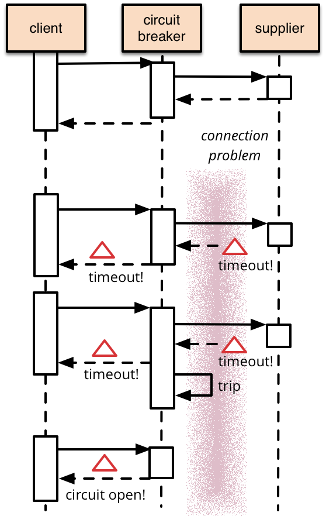
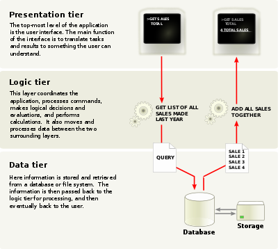
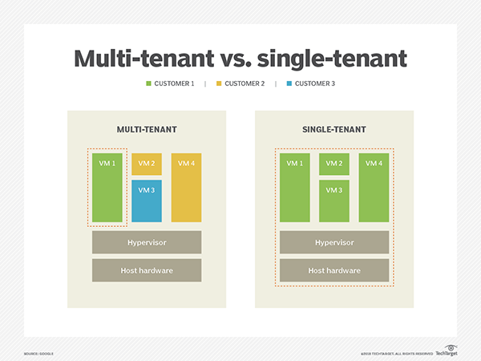

# Terminology

- **bridge networks** : a link layer that forwards traffic between network segments . For docker , a bridge network allows containers connected to the same bridge to communicate while providing isolation from containers which are not connected to that bridge network.
- **Netfilter** a framework provided by the linux kernel that allows customization of networking-related operations, such as packet filtering, NAT, port translation ..

- **IPVS** : (IP Virtual Server) is built on top of the Netfilter and implements transport-layer load balancing as part of the Linux kernel.
- **Virtual Ethernet Device(veth)** act as tunnels between network namespaces to create a bridge to a physical network device in another namespace, can also be used as standalone network devices [...](http://man7.org/linux/man-pages/man4/veth.4.html).
- **underlay network**:defined at the physical level (switchs, routers…)
- **Overlay network**: is a virtual network, composed of vlan, veth (virtual interface) and VxLAN; it encapsulates the network trafic. Overlay is a bit slower than underlay, as it creates tunnels between hosts, which reduces available MTUs (Maximum transmission unit).
- **MTU(Maximum transmission unit)**:is the size of the largest protocol data unit (PDU) that can be communicated in a single network
- **TUN (network TUNnel)** : is a virtual network kernel interface network layer device and operates in layer 3(network) carrying IP packets .
- **TAP** : is a virtual network kernel interface simulates a link layer device and operates in layer 2 carrying Ethernet frames. TUN is used with routing
- **Border Gateway Protocol (BGP)** is a routing protocol which shares its routing informations (tables) with autonomous systems routers [...](https://www.cloudflare.com/learning/security/glossary/what-is-bgp/)
- **Sticky session** :is a process in which a load balancer creates an affinity between a client and a specific network server for the duration of a session .
the load balancer assigns an identifying attribute to a user, typically by issuing a cookie or by tracking their IP details. Then, according to the tracking ID, a load balancer can start routing all of the requests of this user to a specific server for the duration of the session.

- **SCTP (Stream Control Transmission Protocol)**: is a protocol for transmitting multiple streams of data at the same time between two end points that have established a connection in a network.

- **API aggregator**: is an API on top of several APIs.it provides a single point of implementation and delivers a unique and standardized API regardless of what APIs or services it integrates with.
- **Data locality** means moving computation rather than moving data to save the bandwidth.

This minimizes network congestion and increases the overall throughput of the system.
- **NAT**: Network address Translation : NAT translates the IP addresses of computers in a local network in a single IP ADDRESS
- **egress traffic**:  traffic that exits an entity or a network
- **ingress traffic** : enters the boundary of a network

- **CRUD** : Create, read, update and delete
- **Fault tolerance** Is the property that enables a system to continue operating properly even when some of its components fails.

- **Fault Injection**:is a technique which aids in understanding how [virtual/real] system behaves when stressed in unusual ways.
- **Mainframe**: are computers used primary by large organizations for critical applications, data processing ..
- **Circuit breaker**: it's common for microservices to make remote calls to other microservices across a network .Unlike in-memory calls, Remote calls can fail or hang without response until some timeout limit is reached.if you have many callers on unresponsive service :ghost:, then you can run out of critical resources and leading to cascading failures and crushing your system :skull:. Thats where a circuit breaker can step in .

 the basic idea is like electrical circuit breaker : when the number of **consecutive failures** crosses a threshold, the **circuit breaker trips**, and for the duration of a timeout period all temps to invoke the remote **service will fail immediately**
 
- **Idempotent operation** : is an operation with no additional effect if it is called more than once with the same input parameters. In mathematics , an idempotent operation is one where `f(f(x))=f(x)`
- **RBAC**: (Role-Based Access Control) is an approach to restricting system access to authorized users .RBAC lets a user have access rights only to the information they need to .

- **stateless applications**: runs one function or service and does not require a persistent storage to work . all data-flow passed via a stateless service is typically transitory and the state is stored only in a separate a third-party back-end service like a database .Any associated storage is typically ephemeral. it ensures scalability and portability of the application .
- **stateful applications** : are typically databases .those applications processes requests based on the information relayed with each request and information stored from earlier requests .As a result , a stateful application must hold onto state information generated during the processing of the earlier request. [if you wonder how we can maintain state information ? ]( https://www.bizety.com/2018/08/21/stateful-vs-stateless-architecture-overview/)
- **Monolithic application**: describes a single-tiered software application in which the user interface and data access code are combined into a single program from a single platform.A modification made to a small section of code might require building and deploying an entirely new version of software.
- **batch processing**: a group of jobs, data or programs treated as one unit (traitement en lot in french)
- **legacy system**: outdated system but still being used .
- **Greenfield project**: A system developed in a total new environment:  new infra, new customers and even new owners.
- **CNI ( Container Network Interface )**:is a group of specifications and libraries that aims helping network plugins integration [...](https://github.com/containernetworking/cni/blob/master/SPEC.md)
- **CIDR**:(Classless inter-domain routing) also known as Supernets is a method for assigning IP addresses without using the standard IP address classes like Class A, Class B or Class C . For example, in the CIDR address 65.70.30.10/26, the /26 indicates the first 26 bits are used to identify the unique network leaving the remaining bits to identify the hosts. with CIDR , we have more control of the network, we can set a 50.25.11.2/17 mask (which whose forbidden in subnetting with classes) with a total of 32,768 IPs in range between 50.25.0.0 - 50.25.127.255.
- **Multilayered software architecture**: is a client-server architecture in which presentation, application processing, and data management functions are physically separated.
common layers are :
  - Presentation layer: UI to the end-user
  - Application layer: contains all the logic that is required by the application to meet its functional requirements
  - Domain layer ; mostly consisting of domain entities and, in some cases, services. Business rules, like invariants and algorithms, should all stay in this layer.
  - (optional but important) Infrastructure Layer (aka persistent layer ) :enables our application to interact with external systems by receiving, storing and providing data when requested. this optional layer will make our application loosely coupled from the technology used .
- **Three-tier architecture**: based on multi-layered architecture and composed from three main layers : presentation tier were the UI is exposed, application tier where all processing is done and data layer where all data is exchanged and stored .

- **Cattle, not pets approach**: Pets are servers that are treated as indispensable or unique systems that can never be down.Cattle are arrays of more than two servers that are built using automated tools and are designed for failure where **no one is irreplaceable**.
- **Serialization/Deserialization**:serialization is the conversion of **an object to a series of bytes**, so that the object can **easily saved** to persistent storage or streamed across a communication link .the byte stream can then be deserialized means converted into a replica of the original object.( Most used are JSON and google protocol buffers)
- **Race condition**:In multi-threading application , a race condition occurs when two or more threads can access shared data and they try to change it at the same time .
- **8 Fallacies of distributed systems**: Fallacies are a mistaken belief based on unsound arguments .
    - **The network is reliable** : Calls over network will fail due to congestion or hardware failure for example ...
    - **Latency is zero** : Calls over network are not instant . always separate In memory calls and networks calls. Always bring back all the data you might need and not work with chatty mode. Store what can be stored locally.
    - **Bandwidth is infinite** : Bandwidth is limited. use Domain-Driven Design patterns to limit the impact.You should transfer less data to minimize bandwidth usage. You need to balance these two forces and find the right amount of data to send over the wire.
    - **The network is secure** : no it's not . Even you harden security on your own code and your communications , pay attention on using open source libraries, third party legacy systems... An openSSL vulnerability allowed people to steal data protected by SSL/TLS.
    - **Topology doesn’t change** : Network topology changes all the time . Abstract physical structure of the network ( no hardcoding IPs,Dns and service discovery ..) , and adopt Cattle, not pets approch .
    - **There is one administrator** : no one knows everything . On a distributed systems, many persons are involved in the application .If something went wrong, every one must be responsible and tries to solve the problem .Logging , monitoring, decoupling applications and isolating 3rd party dependencies are essential keys for good administration.
    - **Transport cost is zero** : Related to fallacy of zero-latency , Zero cost transport fallacy is related to cost and resource consumption . Transport cost can be either from the cost of the networking infrastructure (On prem instances, Network switchers , SAN ...) or serialization/deserialization (CPU consumption, time cost ..).For infra we can't reduce this cost but for serialization/deserialization it can be redesigned more efficiently by using JSON or Google’s Protocol Buffers and replacing old systems like SOAP or XML.
    - **The network is homogeneous** :A homogeneous network is a network where all components have the same config and the same communication protocol. all networks in the world is not homogeneous so we have to standardize formats in order to avoid vendor lock-in.
- **Sidecar design pattern** allows you to add a number of capabilities to your application without additional configuration code for third-party components.As a sidecar is attached to a motorcycle, similarly in software architecture a sidecar is attached to a parent application and extends/enhances its functionalities. A sidecar is loosely coupled with the main application.**if a sidecar is detached the main functionality will still do her main goal**
-  **Microservices**: microservice architecture theory : 'Small autonomous services modeled around a business domain that work together.' by sam newman . a microservice architecture is an architectural style that structures an application as a collection of services that are :
  - **Loosely coupled** : each component of the system has or make use of little or no knowledge of the the components of the system

  - **Highly maintainable and testable**
  - **Independently deployable**
  - **Organized around business capabilities** : Every single team can process an entire business capability . the opposite strategy would be to organize teams and services around technology layers : if we take example of implementing the business capability of  "a reminder is sent by mail" feature .in a classic approach we have to involve UI team, DBA team, the Invoicing Team, the mail/communication team...
  it may lead to duplicated code BUT the cost of duplicating a bit of code is a lot lower than the cost of introducing tight coupling like sharing bib .
  - Owned by a small team

    [🚗 more on microservices topic](https://medium.com/citerus/whats-the-deal-with-this-microservices-thing-everyone-talks-about-fecc2883049a)
    [ 🎓 topic to study From Monolith to Microservices ](https://dzone.com/articles/from-monolith-to-microservices)
    - [ ] :construction_worker: try to migrate from a monolithic application to microservices application  [refer to] (https://medium.com/jeroen-rosenberg/from-monolith-to-microservice-architecture-on-kubernetes-part-1-the-api-gateway-eb82f8c2d10c )
    - 👷 [1st example] (https://github.com/ticket-monster-msa/monolith)
    - 👷 [2nd example] (https://github.com/micro-example/monolith-to-microservices)
    - 👷 [3rd example] (https://github.com/vmudigal/microservices-sample)
- **Serverless Architecture** : is a way of building applications without need to manage infrastructure . Developers will more focus on their code rather then the infra .   

  [🚗 more about Serverless topic](https://medium.com/swlh/serverless-architecture-complete-reference-guide-2019-55363c08d1be)
  >The essence of the **serverless** trend is the absence of the server concept **during software development**

  :question: is it cheaper than classic approach ? : it depends , Car analogy :
  

  - **Multi-tenancy architecture** is an architecture in which a single instance of a software application serves multiple customers.Each customer is called a tenant. Tenants may be given the ability to customize some parts of the application, such as color of the user interface (UI) or business rules, but they cannot customize the application's code.
  

- **Namespace**: an abstraction used in k8s to support multiple virtual clusters on the same physical cluster.
- **Kops**: tool to deploy a production grade kubernetes cluster .
- **Velero**: tool to backup and restore k8s cluster resources and persistent volumes.
- **longhorn**: distributed block storage used to backup volumes to secondary storage (NFS or s3-compatible object storage ) and incremental snapshot of block storage.
- **Service mesh**: A service mesh is a way to control how different parts of an application **share data with one another**. Unlike other systems for managing this communication, a service mesh is a dedicated infrastructure layer built right into an app. This visible infrastructure layer can document how well (or not) different parts of an app interact, so it becomes easier to optimize communication and avoid downtime as an app grows.
- **Production Ready K8s**:https://www.weave.works/blog/what-does-production-ready-really-mean-for-a-kubernetes-cluster
- **Consensus algorithms**:is algorithms used to achieve agreement on a single data value among distributed processes or systems. the main goal of those algorithms is to achieve network reliability (trustworthy) involving multiple unreliable nodes.As a result Consensus algorithms must be **fault tolerent**.Applications of consensus algorithms include:
  - Deciding whether to commit a distributed transaction to a database.
  - Designating node as a leader for some distributed task.
  - Synchronizing state machine replicas and ensuring consistency among them.

- **Qorum**:is the minimum number of votes that a distributed transaction has to obtain in order to be allowed to perform an operation in a distributed system
