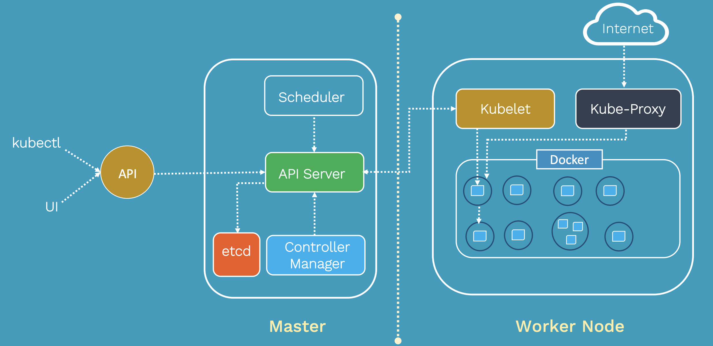
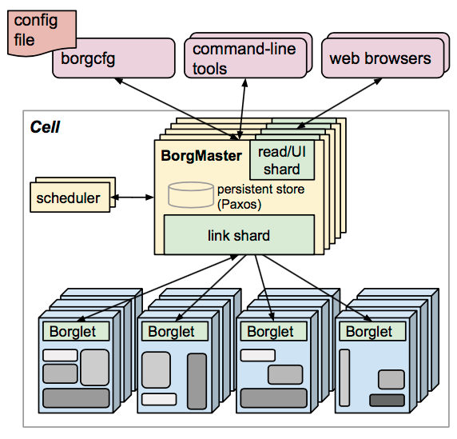
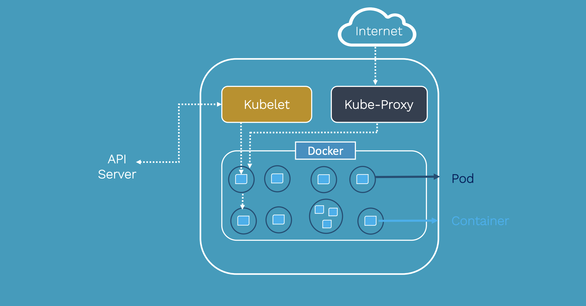
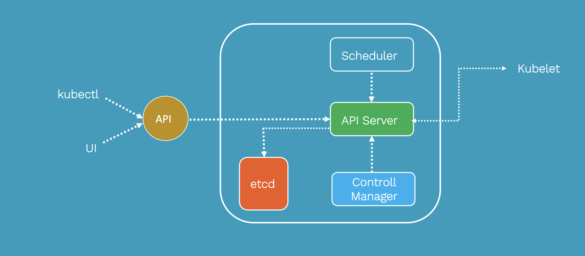
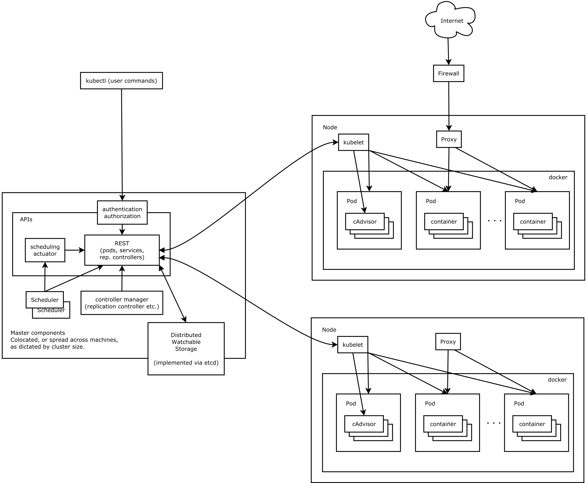
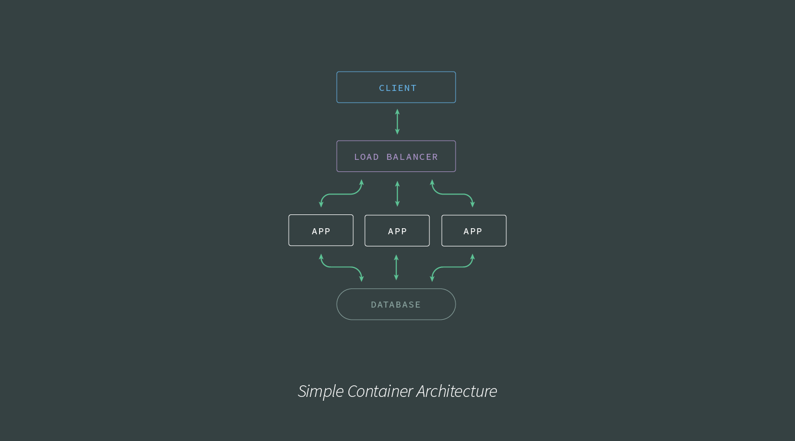
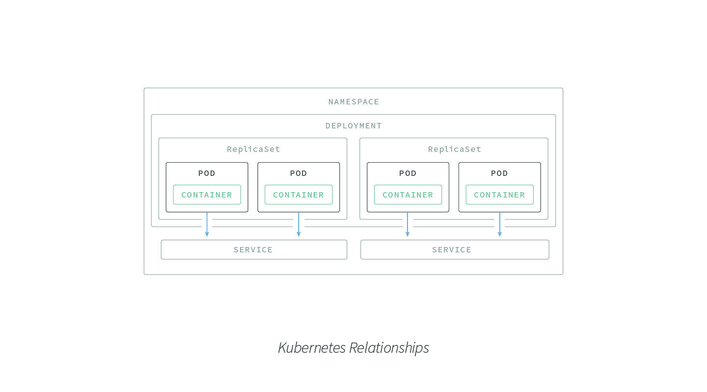
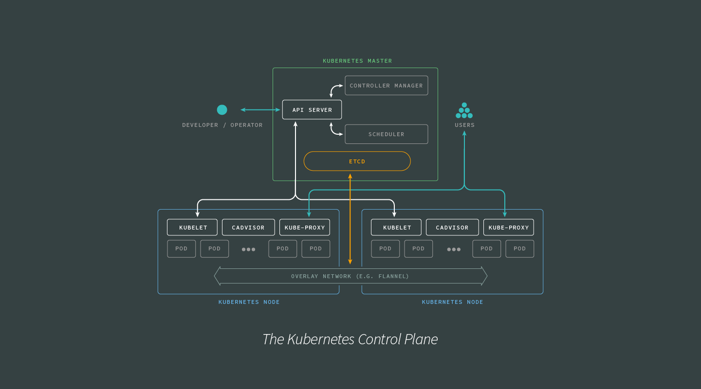

Ceci est le cache Google de https://medium.com/tkssharma/kubernetes-architecture-quick-introduction-4ade0bd250d3. Il s'agit d'un instantané de la page telle qu'elle était affichée le 9 nov. 2019 14:00:24 GMT. La page actuelle peut avoir changé depuis cette date. En savoir plus.
**Version intégrale** Version en texte seul Afficher la source
Astuce : Pour trouver rapidement votre terme de recherche sur cette page, appuyez sur **Ctrl+F** ou sur ⌘ **+F** (Mac), puis utilisez la barre de recherche.

# Kubernetes architecture Quick

# Introduction

```
Tarun Sharma Follow
Sep 14 · 9 min read
```
```
In this post, we will look at Kubernetes and its Architecture
```

```
K8S Kubernetes Originally derived from Google’s internal Borg, Kubernetes
provides an application-oriented container cluster deployment and
management system. Kubernetes’ goal is to eliminate the burden of
orchestration of physical/virtual computing, network and storage
infrastructure, and to allow application operators and developers to focus
entirely on container-centric primitives for self-service operations.
Kubernetes also provides a stable, compatible foundation (platform) for
building custom workflows and more advanced automation tasks.
```
```
Kubernetes has comprehensive cluster management capabilities, including
multi-level security and access mechanisms, multi-tenant application
support capabilities, transparent service registration and service discovery
mechanisms, built-in load balancer, fault discovery and self-healing
capabilities, and service rolling upgrades And online expansion, scalable
resource automatic scheduling mechanism, multi-granularity resource
quota management capabilities. Kubernetes also provides comprehensive
management tools covering development, deployment testing, and
operation and maintenance monitoring.
```
## Introduction to Borg

```
Borg is a large-scale cluster management system within Google that is
responsible for the scheduling and management of many-core services
within Google. Borg’s goal is to enable users to worry about resource
management issues, focus on their core business, and maximize resource
utilization across multiple data centers.
```
```
Borg is mainly composed of BorgMaster, Borglet, borgcfg and Scheduler, as
shown in the figure below.
```

```
BorgMaster is the brain of the entire cluster, responsible for maintaining
the state of the entire cluster and persisting data into Paxos storage;
Scheduler is responsible for the scheduling of tasks, scheduling them to
specific machines according to the characteristics of the application;
Borglet is responsible for actually running the task (in the container);
Borgcfg is Borg’s command-line tool for interacting with the Borg
system, typically through a configuration file to submit tasks.
```
## Kubernetes architecture

```
Kubernetes draws on Borg’s design philosophy, such as Pod, Service, Label,
and single Pod single IP. The overall architecture of Kubernetes is very
similar to Borg, as shown below.
```
```
This architecture of Kubernetes provides a flexible, loosely-coupled
mechanism for service discovery. Like most distributed computing
platforms, a Kubernetes cluster consists of at least one master and multiple
compute nodes.
```

The master is responsible for exposing the application program interface
(API), scheduling the deployments and managing the overall cluster. Each
node runs a container runtime, such as Docker or rkt, along with an agent
that communicates with the master.

The worker nodes also runs additional components for logging, monitoring,
service discovery and optional add-ons. Nodes are the workhorses of a
Kubernetes cluster. They expose compute, networking and storage
resources to applications. Nodes can be virtual machines (VMs) running in
a cloud or bare metal servers running within the data center.

Figure 2: Kubernetes breaks down into multiple architectural components.

A pod is a collection of one or more containers. The pod serves as
Kubernetes’ core unit of management. Pods act as the logical boundary for
containers sharing the same context and resources. The grouping
mechanism of pods makes up for the differences between containerization
and virtualization by making it possible to run multiple dependent
processes together. At runtime, pods can be scaled by creating replica sets,
which ensure that the deployment always runs the desired number of pods.

Replica sets deliver the required scale and availability by maintaining a pre-
defined set of pods at all times. A single pod or a replica set can be exposed
to internal or external consumers via services. Services enable the discovery
of pods by associating a set of pods to a specific criterion. Pods are
associated to services through key-value pairs called labels and selectors.
Any new pod with labels that match the selector will automatically be
discovered by the service. This architecture provides a flexible, loosely-
coupled mechanism for service discovery.


The definition of Kubernetes objects, such as pods, replica sets and services,
are submitted to the master. Based on the defined requirements and
availability of resources, the master schedules the pod on a specific node.
The node pulls the images from the container image registry and
coordinates with the local container runtime to launch the container.
etcd is an open source, distributed key-value database from CoreOS, which
acts as the single source of truth (SSOT) for all components of the
Kubernetes cluster. The master queries etcd to retrieve various parameters
of the state of the nodes, pods and containers.


```
all components together
```
Kubernetes consists mainly of the following core components:

### Etcd saves the state of the entire cluster;

```
Apiserver provides a unique entry for resource operations and provides
mechanisms for authentication, authorization, access control, API
registration, and discovery;
The controller manager is responsible for maintaining the state of the
cluster, such as fault detection, automatic expansion, rolling updates,
etc.
The scheduler is responsible for scheduling resources, and scheduling
Pods to corresponding machines according to a predetermined
scheduling policy;
Kubelet is responsible for maintaining the life cycle of the container, and
is also responsible for the management of Volume (CSI) and Network
(CNI);
The Container runtime is responsible for image management and the
real operation of the Pod and container (CRI);
Kube-proxy is responsible for providing service discovery and load
balancing within the cluster for the Service;
```
In addition to the core com

```
Orchestration demands for simple and complex container architectures.
An overview of container orchestration and Kubernetes.
Networking in a containerized environment.
```
## The Orchestration Layer

In a containerized architecture, the orchestration layer oversees container
deployment, scaling, and management. The orchestration layer
accomplishes:


```
Scheduling of containers to physical/virtual machines, sometimes
encompassing thousands of container-machine relationships.
Restarting containers if they stop.
Enabling container networking.
Scaling containers and associated resources up and down as needed.
Service discovery.
```
There has been a lot of buy-in from a range of IaaP and IaaS providers
around container orchestration. Depending on how distributed your
organization’s container architecture is, there are several options for
orchestration that provide correspondingly complex (or simple)
capabilities.

## Orchestrating Simpler Architectures

What’s a simple Node.js architecture? If your application is supported by
just a few processes, one or two databases, a load balancer, a client, and
exists on a single host — or something comparable to this scale — then your
orchestration demands can most likely be met by Docker’s orchestration
tooling.

If, however, your container architecture is more in line with the following
image, an orchestration solution such as Amazon ECS, Nomad, or
Kubernetes is more suited to at-scale production demands. let's talk about
K8S

## Kubernetes Components

The master-node based architecture of Kubernetes lends it to rapid,
horizontal scaling. Networking features help facilitate rapid communication
between, to, and from the various elements of Kubernetes.

```
Here are the core components of the Kubernetes architecture:
```
```
Pod: The smallest deployable unit created and managed by Kubernetes,
a Pod is a group of one or more containers. Containers within a Pod
share an IP address and can access each other via localhost as well as
enjoy shared access to volumes.
Node: A worker machine in Kubernetes. Maybe a VM or a physical
machine, and comes with services necessary to run Pods.
Service: An abstraction which defines a logical set of Pods and a policy
for accessing them. Assigns a fixed IP address to Pod replicas, allowing
other Pods or Services to communicate with them.
ReplicaSet: Ensures that a specified number of Pod replicas are running
at any given time. K8s recommend using Deployments instead of directly
manipulating ReplicaSet objects unless you require custom update
orchestration or don’t require updates at all.
Deployment: A controller that provides declarative updates for Pods
and ReplicaSets.
Namespace: Virtual cluster backed by the same physical cluster. A way
to divide cluster resources between multiple users, and a mechanism to
attach authorization and policy to a subsection of a given cluster.
```
The following image provides a visual layout describing the various scopes
of the Kubernetes components:

#### LABELS AND SELECTORS

Kubernetes has provided several features for differentiating between users
and objects:

```
Labels: Key/value pairs attached to objects (like a Pod) containing
identifying metadata, such as release line, environment, and stack tier.
Selectors: The core grouping primitive in Kubernetes. Label selectors
enable grouping or managing of objects via their labels.
```
Labels, selectors, and namespaces are critical in enabling Kubernetes to be
so flexible and dynamic in its configuration capabilities. Bear in mind that
the label selectors of two controllers must not overlap within a namespace,
otherwise, there will be conflicts.

As Kubernetes itself is built on a distributed architecture, it excels at
building and managing microservice and other distributed architectures.
While burrowing into the details of the various services that power
Kubernetes is outside the scope of this article, the following image shows a
higher-level look at the interactions between the various elements of the
Kubernetes Control Plane:

Keep the Control Plane information flows in mind as we look into how
Kubernetes handles container networking.

## Container Networking

Networking between containers is one of the more demanding software
challenges in container orchestration. In this section, we will look at how
Docker handles container networking, how this approach limits Docker’s
abilities to orchestrate containers at scale, and how the Kubernetes
approach to networking challenges makes Kubernetes orchestration better
suited for graceful, rapid scaling.


## Networking the Docker Way

```
By default, Docker containers use host-private networking. To do this,
Docker provisions a ‘virtual bridge,’ called docker0 by default, on the host
with space for each container provisioned inside the bridge. To connect to
the virtual bridge, Docker allocates each container a veth (virtual ethernet
device), which is then mapped to appear as eth0in the container via
network address translation (NAT). NAT is a method of mapping one IP
address into another by modifying network address information in the IP
headers of packets.
```
#### This presents a couple of problems for DevOps:

```
First and most importantly, Docker containers networked via bridging can
only talk to containers on the same machine or virtual bridge. This is okay
for projects of limited scale with fairly narrow networking demands but
problematic once many hosts and machines are involved. Secondly, the
reliance on NAT can lead to a non-negligible hit on performance.
```
## Networking the Kubernetes Way

```
Networking with Kubernetes is intended to be more performant and
scalable than with the default Docker tooling. To make this possible,
Kubernetes networking implementations must meet the following
requirements:
```
```
All containers can communicate with all other containers without NAT.
All Nodes can communicate with all containers (and vice versa) without
NAT.
A container reference itself with the same IP address that other
containers use to reference it.
```
```
When these conditions are met it becomes much easier to coordinate ports
across multiple teams and developers. Software like Flannel, WeaveNet,
and Calico provide well-supported Kubernetes networking
implementations.
```
```
tkssharma/k8s-learning
Learning Kubernetes Exploring Archiecture Kubernetes
Installtion and Setup Exploring Kubernetes...
github.com
```
