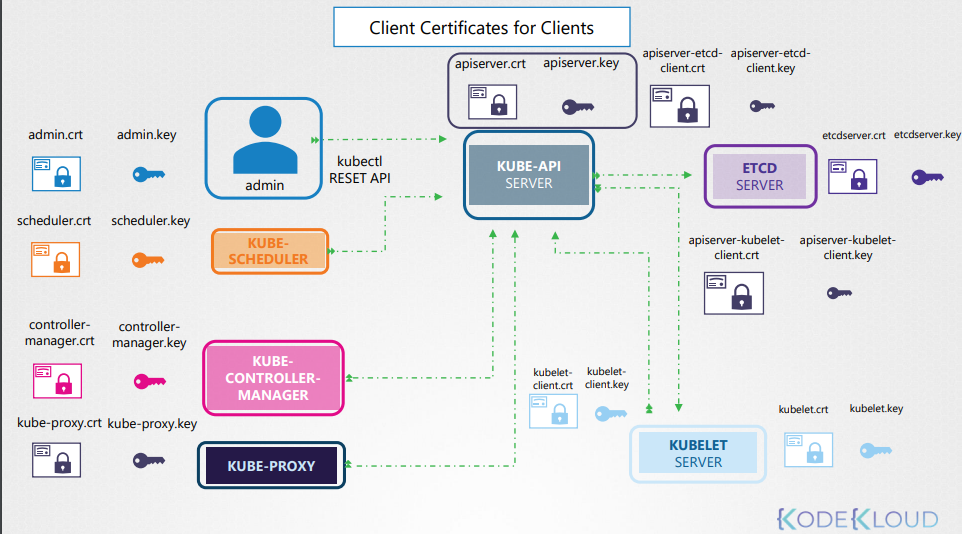

todo 
# certificates in k8s
https://kubernetes.io/docs/tasks/tls/managing-tls-in-a-cluster/

# kubeconfig
context assembles user and cluster to make a coherent config to launch kubectl .
you can specify namespace in cluster section 
you have to client certifcates & key in user when created