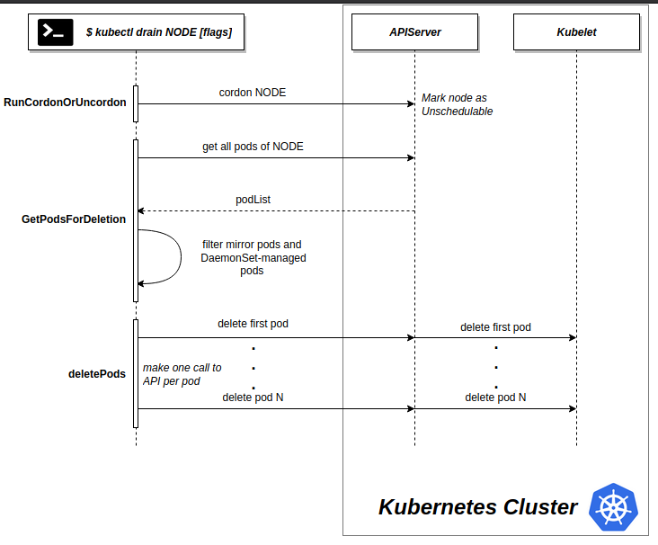

# OS upgrade 

three main commands to keep in mind : 

- `kubectl drain node01`: this command will evict all pods scheduled in `node01` and add a taint to mark the node as `unschedulable`. 
- `kubectl uncordon node01` the node will be available and the taint will be removed . scheduler can now schedule pods on them 
- `kubectl cordon node01`we want to keep existing pods on `node01` by no new pods will be scheduled in the node (the pods will not be evicted )

## special case :

- When a pod is scheduled in a node without any controller attached to is ( no replicaSet, deployment or whatever) a warning message will appear saying that the pod is not managed . in this case if we force the drain ,**we will loose the pod forever**
- when Daemonsets exists in the cluster , we have to ignore them `--ignore-daemonsets` in order to proceed to draining the node 



# version upgrade 

- We can only upgrade one minor version at a time
- Components of the cluster can have diffrent versions : 
    - API Server must always have the higher version (x)
    - controller-manager, kube-scheduler, kubectl can have the **equivalent version of API server or minus one version** (x-1)
    - kubelet, kube-proxy can have equivalent version of API server or minus one version or **minus two version** (x-2)
- Kubernetes project supports **only three recent minor version**

## migration process 

0) update kubeadm tool to the version that you want to upgrade to `apt install kubeadm=1.17.0-00`
1) check for recent versions using `kub eadm upgrade plan`
2) drain the master node ( reschedule all pods in other nodes ) `kubectl drain master --ignore-daemonsets`
3) upgrade master components using `kubeadm upgrade apply v1.17.0`this command will fetch master components and reconfigure them 
4) update kubelet `apt install kubelet=1.17.0-00`
5) reschedule the master node `kubeadm uncorden master`
6) check if the master node is ready `kubectl get nodes`
7) Now we need to update kubelet on each node :
    7.1) drain the node
    7.2) update the kubelet 
    7.3) uncordon the node
> **note**: `kubectl get nodes` show us the kubelet version which can be diffrent of the API server version
# backup restore 
## with API Server 
we can use API Server to get all deployed apps and save them in a file : 
`kubectl get all --all-namespaces -o yaml > backup.yml`
## with etcd 
All information concerning the cluster are stored in Etcd. We can create a snapshot of the database and then restore it .


### 1. Get etcdctl utility if it's not already present.

 <!-- Reference: https://github.com/mmumshad/kubernetes-the-hard-way/blob/master/practice-questions-answers/cluster-maintenance/backup-etcd/etcd-backup-and-restore.md -->

```
ETCD_VER=v3.3.13

# choose either URL
GOOGLE_URL=https://storage.googleapis.com/etcd
GITHUB_URL=https://github.com/etcd-io/etcd/releases/download
DOWNLOAD_URL=${GOOGLE_URL}

rm -f /tmp/etcd-${ETCD_VER}-linux-amd64.tar.gz
rm -rf /tmp/etcd-download-test && mkdir -p /tmp/etcd-download-test

curl -L ${DOWNLOAD_URL}/${ETCD_VER}/etcd-${ETCD_VER}-linux-amd64.tar.gz -o /tmp/etcd-${ETCD_VER}-linux-amd64.tar.gz
tar xzvf /tmp/etcd-${ETCD_VER}-linux-amd64.tar.gz -C /tmp/etcd-download-test --strip-components=1
rm -f /tmp/etcd-${ETCD_VER}-linux-amd64.tar.gz

/tmp/etcd-download-test/etcd --version
ETCDCTL_API=3 /tmp/etcd-download-test/etcdctl version

mv /tmp/etcd-download-test/etcdctl /usr/bin
```

### 2. Backup

```sh
ETCDCTL_API=3 etcdctl --endpoints=https://[127.0.0.1]:2379 --cacert=/etc/kubernetes/pki/etcd/ca.crt \
     --cert=/etc/kubernetes/pki/etcd/server.crt --key=/etc/kubernetes/pki/etcd/server.key \
     snapshot save /tmp/snapshot-pre-boot.db
```
>to verify the command you can use ``etcdctl member list``
### -----------------------------
### Disaster Happens
### -----------------------------

### 3. Restore ETCD Snapshot to a new folder

```sh
ETCDCTL_API=3 etcdctl --endpoints=https://[127.0.0.1]:2379 --cacert=/etc/kubernetes/pki/etcd/ca.crt \
     --name=master \
     --cert=/etc/kubernetes/pki/etcd/server.crt --key=/etc/kubernetes/pki/etcd/server.key \
     --data-dir /var/lib/etcd-from-backup \
     --initial-cluster=master=https://127.0.0.1:2380 \
     --initial-cluster-token etcd-cluster-1 \
     --initial-advertise-peer-urls=https://127.0.0.1:2380 \
     snapshot restore /tmp/snapshot-pre-boot.db
```

### 4. Modify /etc/kubernetes/manifests/etcd.yaml

Update ETCD POD to use the new data directory and cluster token by modifying the pod definition file at `/etc/kubernetes/manifests/etcd.yaml`. When this file is updated, the ETCD pod is automatically re-created as thisis a static pod placed under the `/etc/kubernetes/manifests` directory.

Update ``--data-dir`` to use new target location

```yml
--data-dir=/var/lib/etcd-from-backup
```

Update new initial-cluster-token to specify new cluster

```yml
--initial-cluster-token=etcd-cluster-1
```

Update volumes and volume mounts to point to new path

```yml
    volumeMounts:
    - mountPath: /var/lib/etcd-from-backup
      name: etcd-data
    - mountPath: /etc/kubernetes/pki/etcd
      name: etcd-certs
  hostNetwork: true
  priorityClassName: system-cluster-critical
  volumes:
  - hostPath:
      path: /var/lib/etcd-from-backup
      type: DirectoryOrCreate
    name: etcd-data
  - hostPath:
      path: /etc/kubernetes/pki/etcd
      type: DirectoryOrCreate
    name: etcd-certs
```

> Note: You don't really need to update data directory and volumeMounts.mountPath path above. You could simply just update the hostPath.path in the volumes section to point to the new directory. But if you are not working with a kubeadm deployed cluster, then you might have to update the data directory. That's why I left it as is. 
