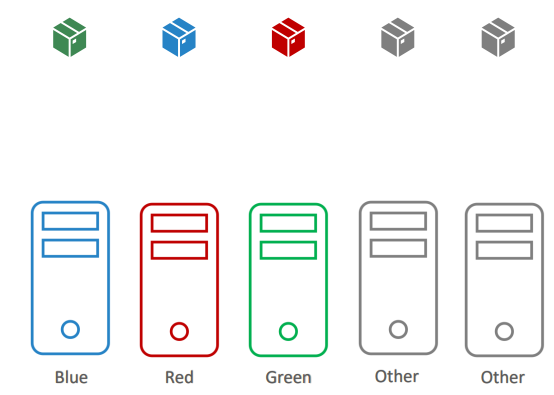

# manual scheduling lab 
todo  

## why a pod can be in a pending state ? 

- no nodes available 
- no schedular available 
- taints & toleration 
- incorrect labels 
> to see which pods are affected to which pods you can use `kubectl get pods -o wide`
## taints&tolerations

Taints and tolerations work together to ensure that pods are not scheduled onto inappropriate nodes.

**Tolerations** are applied to pods, and allow (but do not require) the pods to schedule onto nodes with matching taints.
**taints** will make restriction about either a node will accept or not accept a pod with a certain toleration specified.
**We have to keep in mind :**

- Taints & toleration  DOESN'T guarantee that the pod will be scheduled in that node ❗️
- A node with a taint will have only pods that tolerates that taint
- A pod with a toleration specified can be on a node with a taint **OR NOT**

### Taints - Node

we can add a taint to a node with this syntax: 

````sh
kubectl taint nodes node1 key=value:taint-effect
````

>to remove a taint just add `-` to the end of the command : ``kubectl taint nodes node1 key=value:taint-effect-``

- ``key=value``: the specified taint that we want to declare for example: ``env=blue``
- ``taint-effect``: what happens to pods that DO NOT TOLERATE this taint
  - ``NoSchedule`` : No pod will be able to schedule onto node1 unless it has a matching toleration.
  - ``PreferNoSchedule``: This is a “preference” or “soft” version of ``NoSchedule`` ; the system will try to avoid placing a pod that does not tolerate the taint on the node, but it is not required
  - ``NoExecute`` :Any pods that do not tolerate the taint **will be evicted** immediately, and pods that do tolerate the taint will never be evicted. a ``tolerationSeconds`` field can be specified to dictate for how long the pod will stay bound to the node after the taint is added.

Node-controller automatically taints nodes when certain condition is true :

- ``node.kubernetes.io/not-ready``: Node is not ready. This corresponds to the NodeCondition Ready being “False”.
- ``node.kubernetes.io/unreachable``: Node is unreachable from the node controller. This corresponds to the NodeCondition Ready being “Unknown”.
- ``node.kubernetes.io/out-of-disk``: Node becomes out of disk.
- ``node.kubernetes.io/memory-pressure``: Node has memory pressure.
- ``node.kubernetes.io/disk-pressure``: Node has disk pressure.
- ``node.kubernetes.io/network-unavailable``: Node’s network is unavailable.
- ``node.kubernetes.io/unschedulable``: Node is unschedulable.
- ``node.cloudprovider.kubernetes.io/uninitialized``: : When the kubelet is started with “external” cloud provider, this taint is set on a node to mark it as unusable.

### Toleration - Pod

A toleration is how a pod declares that it can stand the smell of a taint
example :

````yml
apiVersion: v1
kind: Pod
metadata:
  name: nginx
  labels:
    env: test
spec:
  containers:
  - name: nginx
    image: nginx
    imagePullPolicy: IfNotPresent
  tolerations:
  - key: "example-key"
    value: "example-value"
    operator: "Exists"
    effect: "NoSchedule"
````

- ``key/value``: key value pair that will be used to match with taints indicated in nodes 
- ``operator``: can be :
  - ``exists``: The value should be omitted and the toleration will match any taint with the specified key name
  - ``equal``:  the value is required and must match the key value on the taint
- ``effect``: (optional) if specified , it will serve in addition to key as a criteria to match taint.  
for example if we have this toleration below declared :

  ````yml
  tolerations:
  - key: "key"
  operator: "Exists
  ````

  >An empty effect matches all effects with key key.

### Use-cases

- **Dedicated Nodes**: If you want to dedicate a set of nodes for exclusive use by a particular set of users
- **special Hardware** : if you have node that are equped with different architecture (Intel and AMD for example ) or with a GPU
## Nodes Labels 
before talking about node selectors keep in mind that node comes with built-in labels pre-populated with a standard set of labels like : 
- kubernetes.io/hostname
- failure-domain.beta.kubernetes.io/zone
- failure-domain.beta.kubernetes.io/region
- topology.kubernetes.io/zone
- topology.kubernetes.io/region
- beta.kubernetes.io/instance-type
- node.kubernetes.io/instance-type
- kubernetes.io/os
- kubernetes.io/arch
## node selectors
Same as deployments,pods and many other objects on k8s,nodes can also have labels and can be used with `nodeSelector`.this can be useful to affect a workload to a node labeled `high CPU` for example to prevent resource limitations .  
Node selectors are very limited: you can't use them with logical operations for example : place pod in the node labeled `large` or `medium` this is where node affinity are introduced
## node affinity & anti-affinity
Node affinity is are similar to nodeSelector but allows you to constrain which nodes your pod is eligible to be scheduled on, based on **labels on the node.**  
Currently two types of nodes affinity are used :
- ``requiredDuringSchedulingIgnoredDuringExecution`` 
- ``preferredDuringSchedulingIgnoredDuringExecution``
- ``requiredDuringSchedulingRequiredDuringExecution`` : not implemented planned for k8s v1.19
>``IgnoredDuringExecution`` means that if pod is already scheduled on the node and the node doesn't satisfies the affinity anymore due to label remove/addition , the pod will continue to work.

this example below illustrates a pod that uses node affinity:
````yml
apiVersion: v1
kind: Pod
metadata:
  name: with-node-affinity
spec:
  affinity:
    nodeAffinity:
      requiredDuringSchedulingIgnoredDuringExecution:
        nodeSelectorTerms:
        - matchExpressions:
          - key: kubernetes.io/e2e-az-name
            operator: In
            values:
            - e2e-az1
            - e2e-az2
      preferredDuringSchedulingIgnoredDuringExecution:
      - weight: 1
        preference:
          matchExpressions:
          - key: another-node-label-key
            operator: In
            values:
            - another-node-label-value
  containers:
  - name: with-node-affinity
    image: k8s.gcr.io/pause:2.0
````
**Explanation:** 

- the pod can only be placed on a node with a label whose key is ``kubernetes.io/e2e-az-name`` and whose value is either ``e2e-az1`` or ``e2e-az2``.  
- nodes with a label whose key is ``another-node-label-key`` and whose value is ``another-node-label-value`` should be preferred.

For **affinity** you can use those operators: ``In``, ``NotIn``, ``Exists``, ``DoesNotExist``, ``Gt``, ``Lt``  
For **anti-affinity** we can use operators:  ``NotIn`` and ``DoesNotExist``
## node affinity and taints& tolerations together 

We will illustrate a use case where we have to use those two ressources together :

**Description :**
We are sharing the same covenant as cluster with other teams : the same namespace, and the same nodes.  
grey color represents other teams .


**What we want to do :**

- We do not want any other pod to be placed on our node.
- Neither do we want our pods to be placed on their nodes.
- every pod of our teams(colored ones) must be scheduled on the same color's node

**solution :**
Using **node affinity** to ensure that our pods are affected to the correct node with the correct color AND using **taints& tolerations** to prevent other pods to be scheduled in our nodes .

## Resource requirements and limits 
Resource requirements and limits are used by the schedular to decide where to place the pod depending on his requirements and what is available within the nodes .
````yml
apiVersion: v1
kind: Pod
metadata:
  name: default-mem-demo-2
spec:
  containers:
  - name: default-mem-demo-2-ctr
    image: nginx
    resources:
      limits:
        memory: 512Mi
        cpu: "1"
      requests:
        memory: 256Mi
        cpu: "0.5"
````
keep in mind : 

- If a container **consumes more memory** resources than its limit he will be **TERMINATED** with a `OOMKilled` reason in the pod
- A container **can't use more CPU** than the limit because k8s THROTTLES the CPU
- there is a diffrence between `K` and `Ki`:
  - ``K``= 1000 bytes
  - ``Ki``= 1024 bytes
- the default cpu/memory limits are : 
  - ``cpu:1``
  - ``memory:512Mi``


