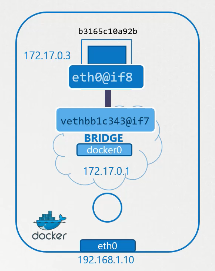

# networking cheat sheet 

````sh
#view established connections:
netstat -anp
# discover via mac address
arp 
# view mac addresses of all network interfaces
ip link
# view all config 
ip a
# map a hoost port to a private port (expose 8080 to public mapped on 80)
iptables -t nat -A PREROUTING -j DNAT --dport 8080 --to-destination 10.101.1.1:80
# connect a private network to a public network via NAT
iptables -t nat -A PREROUTING -s 192.168.1.0/24 -j MASQUERADE
# view namespaces
ip netns
````
>note for etcd:
>2379 is the port of ETCD to which all control plane components connect to. 2380 is only for etcd peer-to-peer connectivity. When you have multiple master nodes.

> in docker world ,every container created will be created in a namespace and attached on a virtual network interface that will act as a bridge to connect the container to others 



kube-proxy networking 
````sh
# view ip tables routes 
iptables -L -t net | grep db-services
# view logs
cat /var/log/kube-proxy.log
````
The network is configured with weave. Check the weave pods logs using command kubectl logs <weave-pod-name> weave -n kube-system and look for ipalloc-range

to quick view apiserver config : `ps -aux | grep kube-api`
- view coreDNS config in `/etc/coredns/Corefile` , to modify it use the ``configMap``