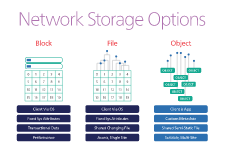
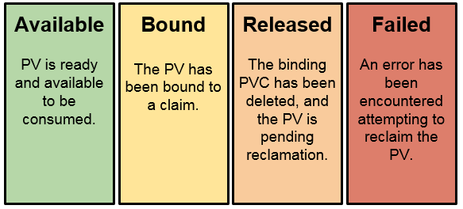
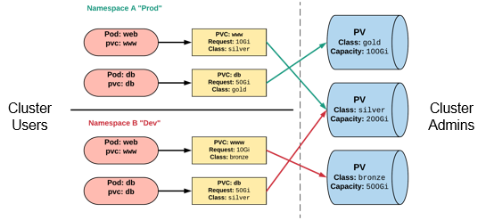
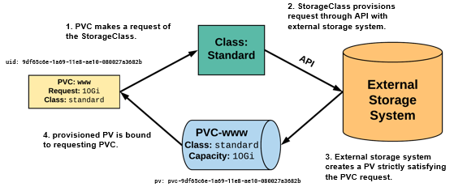

# Storage Concepts
<!-- MDTOC maxdepth:6 firsth1:1 numbering:1 flatten:0 bullets:1 updateOnSave:1 -->

- 1. [File VS Block Vs Object storage](#file-vs-block-vs-object-storage)   
- 2. [Stateful apps in kubernetes](#stateful-apps-in-kubernetes)   
- 3. [Storage in kubernetes](#storage-in-kubernetes)   
- 3.1. [Volumes plugins](#volumes-plugins)   
- 3.1.1. [why In-tree plugins are deprecated ?](#why-in-tree-plugins-are-deprecated)   
- 4. [Volume types](#volume-types)   
- 4.1. [Remote storage](#remote-storage)   
- 4.2. [Ephemeral Storage](#ephemeral-storage)   
- 4.2.1. [EmptyDir :](#emptydir)   
- 4.2.2. [Downward API](#downward-api)   
- 4.2.3. [Host path [dont use this ! :skull:]](#host-path-dont-use-this-skull)   
- 4.2.4. [Local persistent Volume](#local-persistent-volume)   
- 5. [Provisioning Volumes](#provisioning-volumes)   
- 5.1. [Static (PV/PVC)](#static-pvpvc)   
- 5.1.1. [Persistent volume :](#persistent-volume)   
- 5.1.2. [Persistent volume claim :](#persistent-volume-claim)   
- 5.2. [Dynamic (StorageClass)](#dynamic-storageclass)   
- 6. [References](#references)   

<!-- /MDTOC -->

# File VS Block Vs Object storage

The most traditional service type is shared filesystem, or simply “**file storage**”, which as the name implies offers to multiple clients the ability to access a single shared folder. The two most popular shared filesystem protocols in use today are NFS and SMB/CIFS.
Disadvantage: file storage is tied to what type of data you will store

**Block storage** provides network access to the equivalent of raw block devices. A client machine connects to a specific volume on the storage service and formats it as if it were a local block device. Multiple clients do not generally mount the same volume, but they may in master/slave high-availability configurations where the slave needs to be ready to take over the master. Block devices are usually exported over Fibre Channel, iSCSI or AoE (ATA over Ethernet).
Disadvantage: data loose ?

**Object storage** is a relatively new storage type, designed for unstructured data such as media, documents, logs, backups, application binaries and VM images. Conceptually they are like a persistent key/value store; objects are usually submitted via a REST API call, and an identifier returned. Most object stores allow attaching Metadata to objects, and aggregating them into containers (or buckets). The main difference between the other concepts is that the objects are managed via the application itself that supports Object storage. That means that **no real file system is needed** here. This layer is obsolete. An application that uses Object storage sends a storage inquiry to the solution where to store the object. The object is then given an address inside the huge storage space and saved there **by the application itself**.  amazon s3 is an object storage.
Object storage is recommended for Non changed data
the biggest advantage compared to traditional storage : real estimation of data usage
Disadvantage: to update a file , you have to create a new one

# Stateful apps in kubernetes

stateful applications requires persistent storage to store data BUT :

- Containers are ephemeral : no way to persist data (when container crashes/terminates -> :skull: data  )
- Containers can't share data between each other

:rocket: for this we have : kubernetes with (volumes, persistent volumes, persistent volume claims, storageClasses ... )

# Storage in kubernetes

the most important kubernetes principles that we need to keep in mind are :

- **Workload portability**
- **Meet the user where they are**

A kubernetes Volume is :

- Defined in the pod Spec
- Tied to the **Pod's Lifecycle** :
  - when a pod cease to exist , the volume cease to exist
  - Survive when Pod restart
  - Can be attached to any of the containers within the pod
- A pod can have one or more types of volumes attached to it
- Volumes can **not** mount onto other volumes or have hard links to other volumes

At its core, a volume is just a directory, possibly with some data in it, which is accessible to the Containers in a Pod.
**How that directory comes to be, the medium that backs it, and the contents of it are determined by the particular volume type used.**

## Volumes plugins

A Kubernetes Volume plugin extends the Kubernetes volume interface to support a block and/or file storage system.
two main types of plugins :

- In-tree plugins **[Deprecated]**: those plugins were built, linked, compiled, and shipped with the core Kubernetes binaries and extend the core Kubernetes API
- Out-of-tree plugins : are developed independently of the Kubernetes code base, and are deployed (installed) on Kubernetes clusters as extensions.
  - Out-of-tree FlexVolume driver [deprecated]
  - **Out-of-tree CSI driver [ primary volume plugin system for K8s]** : Container Storage Interface (CSI) is a standardized mechanism for Container Orchestration Systems (COs), including Kubernetes, to expose arbitrary storage systems to containerized workloads.

### why In-tree plugins are deprecated

In-tree plugins are tightly coupled and dependent on kubernetes releases : they are hard to maintain and can cause crushes to the master components(Bugs in volume plugins affect critical Kubernetes components).in addition Source code have to be open source which can cause problem to storage vendors
sig-storage decided to :

- No new in-tree plugins are accepted
- existing plugins will be maintained until full migration to CSI plugins
- All new Volume plugin development will be based on CSI  

# Volume types

## Remote storage

this type of storage is provided and maintained by a third-party storage vendor that exposes an API to create,access,update or delete volumes .
most of the remote storage plugins supports persisting data beyond a pod's life cycle, they are referenced in pod either in-line( Not recommended for Workload portability ) or via PV/PVC
Examples:

- GCE Persistent Disk
- AWS Elastic Block Store
- Azure File Storage
- Azure Data Disk
- Dell EMC ScaleIO
- iSCSI
- Flocker
- NFS
- vSphere
- GlusterFS
- Ceph File and RBD
- Cinder
- Quobyte Volume
- FibreChannel
- VMware Photon PD
The advantage of remote storage is the fact that **storage and compute are decoupled** : If node is terminated or crashes (for Resources shortage for example) , the state of the application will be maintained regardless of the state of the node (that stores the data ) or the pod (scheduled in that node).

## Ephemeral Storage

### EmptyDir

Temp scratch file space from host machine(temporarily).this space is usually used to share data (Web-server, pre-process data,socket files, logs)between containers within the same pod.
this type of storage can only be referenced 'in-line'in pod definition (not PV/PVC) and is loosely coupled to Tied to the **Pod's Lifecycle**.

Built-in top of emptyDir:

- Secret (backed by tmpfs 'a RAM-backed filesystem' )
- ConfigMap
- DownwardAPI
- gitRepo

### Downward API

To expose Pod and container fields to a running Container we can declare them as environment variables or volumes files .
For example, we can store the label of the pod (extracted from the API ) as a volume and mount it as a file . The container can then view those informations in the mounted file directly.
We can also use environment vars to expose those types of informations (not in this scope).

Refer to : [Downward API](https://kubernetes.io/docs/tasks/inject-data-application/downward-api-volume-expose-pod-information/)

### Host path [dont use this ! :skull:]

a hostpath volume mounts a file or directory from the node's filesystem into the pod .this type of volumes is not recommended because:

- With this type of volumes the workload portability is uninsured .
- Kubernetes can't manage this type of volumes .

### Local persistent Volume

A Local persistent Volume presents a mounted local storage device such as a disk, partition or directory.

Compared to `hostpath`:

- this type is can be managed by k8s
- Can be statically managed by PC/PVC
Constraints:
- ``Nodeaffinity`` is required when using local volumes. it enables k8s scheduler to correctly schedule pods using local volumes to the correct node.
-  Creating ``volumeBindingMode`` StorageClass with ``WaitForFirstConsumer`` is recommended .Delaying volume binding allows the scheduler to consider all of a pod’s scheduling constraints when choosing an appropriate PersistentVolume for a PersistentVolumeClaim.
- local volumes are subject to the availability of the underlying node and workload portability : If a node becomes unhealthy, then the local volume will also become inaccessible.
Use-case for using local persistent:
- building a distributed storage Systems like datastores (Ceph, cassandra ...)
- High performance caching
- fault and data loss tolerant

# Provisioning Volumes

there are two ways to provision PVs :

## Static (PV/PVC)

A cluster admin creates a number of PVs.They carry the details of the real storage which is available for use by cluster users.  
PVs exist in the kubernetes API and are available for consumption.users uses PVC to request an amount of storage.
``PersistentVolume`` and ``PersistentVolumeClaim`` are storage Abstraction : **Decouple storage implementation from storage consumption**

### Persistent volume

PVs are k8s cluster wide resource linked to a backing storage provider (NFS, GCEPersistentDisk ...): they don't belong to any namespace, they are a **global resource**.Every PV must have a DNS Subdomain Names.**👀PVs cannot be attached to a pod directly (PVCs is the solution )**

There is **multiple options** to configure a PV :

- ``ressources.requests.storage`` : storage size specified  by the [ressource model ](https://git.k8s.io/community/contributors/design-proposals/scheduling/resources.md) (``storage`` : 5Gi)
- ``VolumeMode`` : block to use a raw block device or filesystem (This is an optional API parameter)
- ``AccessMode``: A PV can be mounted on a host in any way supported by the resource provider :exclamation: A volume can only be mounted using one access mode at a time.
  - ``RWO`` :ReadWriteOnce -> read-write by a single node
  - ``ROX`` :ReadOnlyMany -> read-only by many nodes
  - ``RWX`` :ReadWriteMany -> read-write by many nodes
- ``persistentVolumeReclaimPolicy``: When the PVC goes away, what should we do with the PV. Options include:
  - *Retain*: Manual clean-up
  - *Delete*: Storage asset deleted by provider
- ``storageClassName`` : Optional name of a StorageClass that PVC's can reference.If provided, Only PVC's referencing the name consume use it
- ``mountOptions`` : Optional mount options for the PV

**4 states for the PV**:

### Persistent volume claim :

A ``persistentVolumeClaim`` volume is used to mount a PersistentVolume into a Pod. PersistentVolumes are a way for users to “claim” durable storage (such as a GCE PersistentDisk or an iSCSI volume) without knowing the details of the particular cloud environment.
**:exclamation: PVC is based within namespace (with the pod) unlike PV that are considered as global ressource**
three **essential options** for PVCs:

- ``accessModes``: The selected method of accessing the storage MUST be a subset of what is defined on the target PV or Storage Class
- ``ressources.requests.storage`` : The desired amount of storage for the claim
- ``storageClassName`` : The name of the desired Storage Class

## Dynamic (StorageClass)

Storage classes are an abstraction on top of an external storage resource that has dynamic provisioning capability (usually cloud providers, but also CephFS ).  
Those classes are used to automate the provisioning of PV eliminating the need for the cluster admin to pre-provision a PV

**Example of a Storage Class:**

1) A PVC is created with a storage request and supplies the StorageClass ‘standard’
2) The storageClass ‘standard’ is configured with some information to connect and interact with the API of an external storage provider
3) The external storage provider creates a PV that strictly satisfies the PVC request. Really, it means it’s the same size as the request
    - The PV will be named ``pvc-<uid of the pvc>``
4) The PV is then bound to the requesting PVC
Three **essential options** for PVCs:

- ``provisioner``: defines the 'driver' to use for provisioning of the **external storage**
- ``parameters`` : specific to every provider , it can ben availability zone or type .
- ``ReclaimPolicy``: Same as PVs : When the PVC goes away, what should we do with the PV .

# References

- <https://ubuntu.com/blog/what-are-the-different-types-of-storage-block-object-and-file>
- <https://www.caringo.com/blog/back-basics-object-storage>
- <https://www.redhat.com/en/topics/data-storage/file-block-object-storage>
- <https://www.ontrack.com/blog/2018/02/22/the-evolution-of-storage-file-storage-vs-block-storage-vs-object-storage-part-1/>
