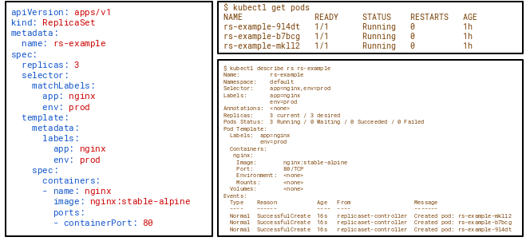
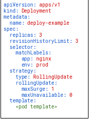

# Workloads

Workloads within Kubernetes are higher level objects that manage Pods or other higher level objects.

In **ALL CASES** a Pod Template is included, and acts the base tier of management.
Pod Template are used by controllers to create new pods .

## ReplicaSets

A ReplicaSet’s purpose is to maintain a stable set of replica Pods running at any given time. As such, it is often used to guarantee the availability of a specified number of identical Pods  

### Implementation

Three main fields are required:
 a number of replicas indicating , and a

* ``replicas`` :How many Pods it should be maintaining
* ``selector``:selector that specifies how to identify Pods that will be managed by the `ReplicaSet` (we are talking of selector outside pod Template) . the selectors are usually the same as the selectors within the template.
* ``template``: pod template specifying the data of new Pods it should create to meet the number of replicas criteria

## Deployments

Deployments are a declarative method of managing Pods via `ReplicaSet` .Deployments manage `ReplicaSet`  which then manage pods.  
**Deployments Provide rollback functionality and update control.** all those updates are managed by a ``pod-template-hash`` .  
``pod-template-hash`` label ensures that child `ReplicaSet`  of a Deployment do **not overlap**. It is generated by hashing the PodTemplate of the `ReplicaSet` and using the resulting hash as the label value that is added to the `ReplicaSet` selector, Pod template labels, and in any existing Pods that the `ReplicaSet` might have .

⚠️ A Deployment’s rollout is triggered if and **ONLY if the Deployment’s Pod template (that is, .spec.template) is changed**, for example if the labels or container images of the template are updated. Other updates, such as scaling the Deployment, do not trigger a rollout.

### Implementation

In addition to `ReplicaSet` required fields, two new fields are required for the deployment : 

* `revisionHistoryLimit`: The number of previous iterations of the Deployment to retain.
* `strategy`: Describes the method of updating the Pods based on the type :
  * `Recreate`: All existing Pods are killed before the new ones are created also known as [Big Bang Deployment](Terminology.md).
  * `RollingUpdate`: Cycles through updating the Pods according to the parameters: 
    * `maxSurge`: How many **ADDITIONAL replicas** we want to spin up while updating
    * ``maxUnavailable``: How many **replicas may be UNAVAILABLE** during the update process

>**Example :**  
>Lets say you’re resource constrained and can only support 3 replicas of the pod at any one time
We could set `maxSurge` to 0 and `maxUnavailable` to 1. This would cycle through updating 1 at a
time without spinning up additional pods.

## StatefulSets

## DaemonSet
